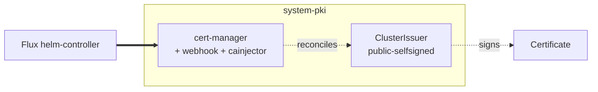
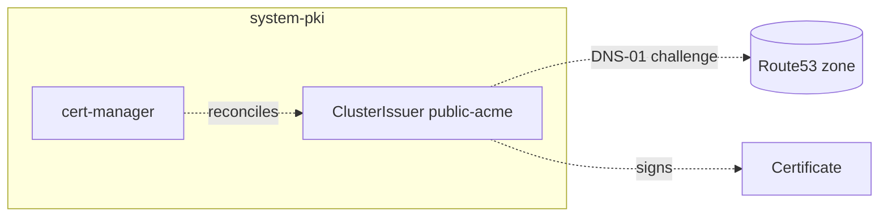
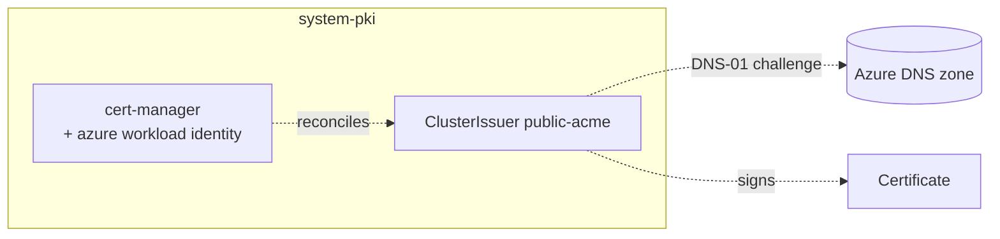
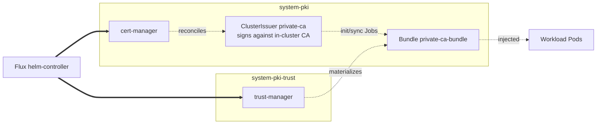

The cluster's certificate-issuance layer. cert-manager's CRDs are
vendored under `kustomize/crds/` and applied ahead of the stack via
the facet `crds:` section. The add-on is a `flux:` system entry
(`pki`) so Flux can reconcile the controller before the ClusterIssuer
CRs that depend on it. `install` installs cert-manager (trust-manager
is added when the private-CA addon is enabled), plus optional patches
that enable Prometheus scraping, Azure workload identity, and
single-node leader-election tweaks. `resources` applies one or more
ClusterIssuers depending on the cluster's DNS and gateway-access
posture, and implicitly depends on `install` (compiled name:
`pki-install` / `pki-resources`); the ACME and private-CA variants
also depend on `policy-resources` for the private-CA inject policy.

The ClusterIssuers this add-on can ship are named consistently across
platforms so downstream `Certificate` resources can reference a stable
name (`private-selfsigned`, `private-ca`, `public-selfsigned`,
`public-acme`). Switching between selfsigned and ACME is a
substitution flip, not a Certificate spec change. cert-manager
reissues into the same Secret.

## Recipes

cert-manager runs in `system-pki` (PSA `baseline`); trust-manager, when
present, runs in `system-pki-trust` (PSA `restricted`).

### Baseline (selfsigned, no private CA)


```mermaid
flowchart LR
  flux[Flux helm-controller]

  subgraph systempki[system-pki]
    cm[cert-manager<br/>+ webhook + cainjector]
    issuer[ClusterIssuer<br/>public-selfsigned]
  end

  cert[Certificate]

  flux ==> cm
  cm -.reconciles.-> issuer
  issuer -.signs.-> cert
```

```yaml
flux:
  - name: pki
    install:
      components: [cert-manager]
      timeout: 20m
    resources:
      - dependsOn: [policy-resources]
        components: [public-issuer/selfsigned]
        timeout: 5m
```

Issues against `public-selfsigned`. Start here on a first cluster; expect
browser warnings until the CA cert is trusted out-of-band.

### Public ACME on AWS


```mermaid
flowchart LR
  subgraph systempki[system-pki]
    cm[cert-manager]
    issuer[ClusterIssuer public-acme]
  end

  route53[(Route53 zone)]
  cert[Certificate]

  cm -.reconciles.-> issuer
  issuer -.DNS-01 challenge.-> route53
  issuer -.signs.-> cert
```

```yaml
flux:
  - name: pki
    resources:
      - dependsOn: [policy-resources]
        components: [public-issuer/acme/route53]
        substitutions:
          acme_server: https://acme-v02.api.letsencrypt.org/directory
          acme_email: you@example.com
          acme_dns_zone: example.com
          acme_hosted_zone_id: <from terraform_output('dns-zone', 'zone_id')>
```

DNS-01 against Route53. Auth comes from the IAM role and Pod Identity
binding the AWS cluster Terraform module provisioned.

### Public ACME on Azure


```mermaid
flowchart LR
  subgraph systempki[system-pki]
    cm[cert-manager<br/>+ azure workload identity]
    issuer[ClusterIssuer public-acme]
  end

  azuredns[(Azure DNS zone)]
  cert[Certificate]

  cm -.reconciles.-> issuer
  issuer -.DNS-01 challenge.-> azuredns
  issuer -.signs.-> cert
```

```yaml
flux:
  - name: pki
    install:
      components: [cert-manager, cert-manager/azure-workload-identity]
      substitutions:
        cert_manager_client_id: <terraform_output('cluster', 'cert_manager_client_id')>
        cert_manager_tenant_id: <terraform_output('cluster', 'tenant_id')>
    resources:
      - dependsOn: [policy-resources]
        components: [public-issuer/acme/azuredns]
        substitutions:
          acme_server: https://acme-v02.api.letsencrypt.org/directory
          acme_email: you@example.com
          acme_dns_zone: example.com
          acme_dns_zone_resource_group: <terraform_output('dns-zone', 'resource_group_name')>
          acme_dns_zone_subscription_id: <terraform_output('dns-zone', 'subscription_id')>
```

DNS-01 against Azure DNS, authed via the AKS federated workload
identity attached by `cert-manager/azure-workload-identity`.

### Private CA with trust-manager distribution


```mermaid
flowchart LR
  flux[Flux helm-controller]

  subgraph systempki[system-pki]
    cm[cert-manager]
    ca[ClusterIssuer private-ca<br/>signs against in-cluster CA]
    bundle[Bundle private-ca-bundle]
  end

  subgraph systempkitrust[system-pki-trust]
    tm[trust-manager]
  end

  workloads[Workload Pods]

  flux ==> cm
  flux ==> tm
  cm -.reconciles.-> ca
  ca -.init/sync Jobs.-> bundle
  tm -.materializes.-> bundle
  bundle -.injected.-> workloads
```

```yaml
flux:
  - name: pki
    install:
      components: [cert-manager, trust-manager]
    resources:
      - dependsOn: [policy-resources]
        components: [private-issuer/ca]
```

`private-ca` ClusterIssuer signs against an in-cluster selfSigned CA.
The init and sync Jobs extract the CA cert into a `Bundle`, which
trust-manager materializes into a Secret/ConfigMap that downstream
namespaces can mount.

## Operations

If `cert-manager-controller` restarts with `Last State: Terminated,
Reason: Completed` and its logs show `clockHealth failed: the system
clock is out of sync with the internal monotonic clock`, this is
expected on docker-desktop/colima after the host laptop sleeps. The VM
pauses. On wake its wall clock steps forward while the running
controller's monotonic baseline does not, which trips cert-manager's
`/livez` clock check (~5m tolerance, not configurable through Helm
values). The restart resets the baseline. It stops recurring once the
host stays awake long enough for the VM's clock sync to converge.

<!-- BEGIN_KUSTOMIZE_DOCS -->

## Substitutions

| Name | Required when | Effect |
|---|---|---|
| `cert_manager_client_id` | `cert-manager/azure-workload-identity` is enabled | Azure AD client ID for the cert-manager managed identity. Sourced from `terraform_output('cluster', 'cert_manager_client_id')`. |
| `cert_manager_tenant_id` | `cert-manager/azure-workload-identity` is enabled | Azure AD tenant ID for the federated workload identity credential. |
| `acme_server` | any `public-issuer/acme/*` component is enabled | ACME directory URL. Resolves to `acme-staging-v02.api.letsencrypt.org` in dev, `acme-v02.api.letsencrypt.org` otherwise. |
| `acme_email` | any `public-issuer/acme/*` component is enabled | Contact email Let's Encrypt registers against the ACME account. Sourced from top-level `email`. |
| `acme_dns_zone` | any `public-issuer/acme/*` component is enabled | FQDN of the DNS zone cert-manager writes DNS-01 challenges into. Sourced from `dns.public_domain`. |
| `acme_hosted_zone_id` | `public-issuer/acme/route53` is enabled | Route53 hosted zone ID. Threaded via deferred `terraform_output('dns-zone', 'zone_id')` so the ACME ClusterIssuer reissues automatically when the dns-zone stack first applies. |
| `acme_dns_zone_resource_group` | `public-issuer/acme/azuredns` is enabled | Azure resource group holding the public DNS zone. Sourced from `terraform_output('dns-zone', 'resource_group_name')`. |
| `acme_dns_zone_subscription_id` | `public-issuer/acme/azuredns` is enabled | Azure subscription ID for the public DNS zone. Sourced from `terraform_output('dns-zone', 'subscription_id')`. |
| `acme_dns_zone_project` | `public-issuer/acme/clouddns` is enabled | GCP project holding the public Cloud DNS zone. Sourced from `gcp.project_id`. |
| `cert_manager_service_account_email` | `cert-manager/gcp-workload-identity` is enabled | Email of the cert-manager Google Service Account. Sourced from `terraform_output('cluster', 'cert_manager_service_account_email')`. |

## Components — `pki-install`

### `cert-manager`

_Enabled when always._

Helm release of the `cert-manager` chart in `system-pki`. Installs the controller, webhook, and cainjector (chart CRD install is skipped). The cert-manager CRDs are vendored under `kustomize/crds/` and applied ahead of the controller via the facet `crds:` section, so `pki-resources` can consume ClusterIssuer / Certificate CRs.

### `cert-manager/single-node`

_Enabled when single-node topology._

Patches the cert-manager HelmRelease to disable leader election on the controller (single replica has nothing to elect against).

### `cert-manager/azure-workload-identity`

_Enabled when platform is Azure AND `dns.public_domain` is set._

Patches the cert-manager Deployment to attach the AKS federated workload identity used by the DNS-01 ACME solver against Azure DNS. Reads `cert_manager_client_id` and `cert_manager_tenant_id`.

### `cert-manager/gcp-workload-identity`

_Enabled when platform is GCP AND `dns.public_domain` is set._

Annotates the cert-manager ServiceAccount with the GKE Workload Identity binding used by the DNS-01 ACME solver against Cloud DNS. Reads `cert_manager_service_account_email`.

### `cert-manager/prometheus`

_Enabled when `telemetry.metrics.enabled: true`._

Patches the cert-manager HelmRelease to enable Prometheus annotations / ServiceMonitor on the controller and webhook.

### `trust-manager`

_Enabled when `pki.enabled: true`._

Helm release of the `trust-manager` chart in `system-pki-trust` (PSA `restricted`). Depends on cert-manager. Consumes `Bundle` CRs to distribute the private CA into workload namespaces.

| Variant | Enabled when | Effect |
|---|---|---|
| `single-node` | single-node topology AND `pki.enabled: true` | Patches the trust-manager HelmRelease to disable leader election. |

## Components — `pki-resources`

### `private-issuer`

The cluster's internal trust anchor, issuing the etcd and private-gateway certificates. Exactly one variant is active at a time.

| Variant | Enabled when | Effect |
|---|---|---|
| `selfsigned` | `pki.enabled` is not set | ClusterIssuer `private` with `selfSigned: {}`. Browsers warn on anything it signs. `pki.enabled` replaces it with the CA-backed `ca` variant under the same name. |
| `ca` | `pki.enabled: true` | Full private CA: the CA cert/key (generated or BYO, from `terraform_output('pki', ...)`) populate the `private-ca-keypair` Secret (`system-pki` only) cert-manager's `ca`-type `ClusterIssuer` (`private`) signs against, and the cert alone populates the `private-ca-trust-cert` Secret (`system-pki-trust` only, no private key) trust-manager's `Bundle` reads from — both via the facet's `secrets:` block (never rendered in the Kustomization spec, and never through a Flux substitution — a substituted multi-line PEM value loses its line breaks). A Kyverno mutation policy injects the resulting trust bundle into workload Pods. |

### `public-issuer`

_Enabled when `pki.enabled: true`._

Full private CA: the CA cert/key (generated or BYO, from `terraform_output('pki', ...)`) populate the `private-ca-keypair` Secret (`system-pki` only) cert-manager's `ca`-type `ClusterIssuer` (`private`) signs against, and the cert alone populates the `private-ca-trust-cert` Secret (`system-pki-trust` only, no private key) trust-manager's `Bundle` reads from — both via the facet's `secrets:` block (never rendered in the Kustomization spec, and never through a Flux substitution — a substituted multi-line PEM value loses its line breaks). A Kyverno mutation policy injects the resulting trust bundle into workload Pods.

### `public-issuer/selfsigned`

_Enabled when `dns.public_domain` is unset (default)._

ClusterIssuer `public-selfsigned`. Bootstraps a working gateway cert immediately; flip to `acme/*` by setting `dns.public_domain` and cert-manager reissues into the same Secret.

### `public-issuer/acme/route53`

_Enabled when platform is AWS AND `dns.public_domain` is set._

ClusterIssuer `public-acme` using the ACME DNS-01 solver against Route53. Auth is via the Pod Identity binding provisioned by the cluster Terraform module.

### `public-issuer/acme/azuredns`

_Enabled when platform is Azure AND `dns.public_domain` is set._

ClusterIssuer `public-acme` using the ACME DNS-01 solver against Azure DNS. Auth is via the federated workload identity (see `cert-manager/azure-workload-identity`).

### `public-issuer/acme/clouddns`

_Enabled when platform is GCP AND `dns.public_domain` is set._

ClusterIssuer `public-acme` using the ACME DNS-01 solver against Cloud DNS. Auth is via the GKE Workload Identity binding (see `cert-manager/gcp-workload-identity`).

## Dependencies

| Add-on | Required when | Reason |
|---|---|---|
| `policy-resources` | `policies.enabled: true` | pki-install depends on Kyverno baseline policies being active before cert-manager pods are admitted into `system-pki`. pki-resources depends on `policy-resources` so the private-CA inject policy (when private_ca is on) doesn't apply before Kyverno itself is reconciling. |
| `telemetry-install` | `cert-manager/prometheus` is enabled | The ServiceMonitor added by `cert-manager/prometheus` needs Prometheus to be live to scrape. |

<!-- END_KUSTOMIZE_DOCS -->

## See also

- [contexts/_template/facets/platform-base.yaml](../../contexts/_template/facets/platform-base.yaml) for the base cert-manager and selfsigned defaults.
- [contexts/_template/facets/platform-aws.yaml](../../contexts/_template/facets/platform-aws.yaml) for ACME on Route53 wiring.
- [contexts/_template/facets/platform-azure.yaml](../../contexts/_template/facets/platform-azure.yaml) for ACME on AzureDNS plus workload-identity wiring.
- [contexts/_template/facets/addon-private-ca.yaml](../../contexts/_template/facets/addon-private-ca.yaml) for trust-manager and private CA wiring.
- Related add-ons: [policy](../policy/), [telemetry](../telemetry/), [gateway](../gateway/) (consumes the ClusterIssuer for the external gateway cert), [observability](../observability/) (Elasticsearch consumes the private CA).
