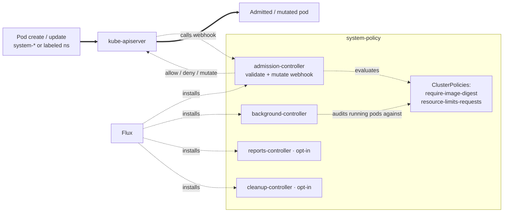

# Policy

Kyverno is the policy engine. The add-on splits across two
Kustomization paths so Flux can reconcile the operator (CRDs +
workloads) before the ClusterPolicy CRs that depend on those CRDs.
`policy-base` installs the Kyverno Helm release, with optional patches
that enable the reports and cleanup controllers. `policy-resources`
applies the baseline ClusterPolicies that this blueprint relies on,
and depends on `policy-base`.

The baseline policies match Pods in `system-*` namespaces and in
namespaces labeled `policy.windsorcli.dev/managed: true`. Workload
namespaces that opt out (label set to `false`) or unlabeled
non-`system-*` namespaces aren't subject to these policies.

## Architecture



The admission controller blocks Pod admission when an Enforce policy
fails. The background controller audits existing Pods against Audit
policies and writes Events and PolicyReports (the latter only when
`kyverno/reports` is enabled).

## Webhook availability

A webhook with `failurePolicy: Fail` rejects matching requests when the
admission controller is unreachable, so an unavailable Kyverno can lock
out resource creation. Three things bound that risk:

- The webhook `namespaceSelector` excludes `kube-system` and the GitOps
  namespace (`FLUX_SYSTEM_NAMESPACE`, default `system-gitops`). The
  kube-apiserver honours this even when Kyverno is down, so Flux can
  always reconcile a recovery.
- Validating policies and tightly scoped mutating policies stay `Fail`.
  Fail closed is the safe default for a security gate or a CA-trust
  injection, and a label or namespace match keeps the blast radius small.
  Broad, cosmetic mutations such as the localhost DNS-target injection
  use `Ignore` so they fail open.
- On `topology == 'ha'`, `kyverno/ha` runs the controller with three
  replicas and a PDB so the webhook backend stays reachable through
  drains and rollouts.

## Recipes

### Baseline (admission + ClusterPolicies)

```yaml
- name: policy-base
  path: policy/base
  components: [kyverno]
  timeout: 30m

- name: policy-resources
  path: policy/resources
  dependsOn: [policy-base]
  components:
    - kyverno/resource-limits-requests
    - kyverno/require-image-digest
  timeout: 5m
```

This is what `policies.enabled: true` materializes (the default).

### With Policy Reports

```yaml
- name: policy-base
  path: policy/base
  components: [kyverno, kyverno/reports]
```

Set `policies.reporting: enabled`. PolicyReport and
ClusterPolicyReport CRs are written for every evaluation, suitable
for ingest by Policy Reporter or Grafana dashboards.

### With Cleanup Policies

```yaml
- name: policy-base
  path: policy/base
  components: [kyverno, kyverno/cleanup]
```

Set `policies.cleanup: enabled`. The blueprint ships no
`CleanupPolicy` CRs out of the box, so enable this only if you intend
to add your own.

<!-- BEGIN_KUSTOMIZE_DOCS -->

## Substitutions

| Name | Required when | Effect |
|---|---|---|
| `FLUX_SYSTEM_NAMESPACE` | always (defaults to `system-gitops`) | Namespace excluded from the Kyverno admission webhooks alongside `kube-system`, so Flux can always reconcile even if the admission controller is unavailable. |

## Components — `policy-base`

| Component | Enable when | Effect |
|---|---|---|
| `kyverno` | always | Helm release of Kyverno in `system-policy`. Installs the admission, background, and reports controllers (the cleanup controller is disabled at this layer; opt in via `kyverno/cleanup`). NO_COLOR is set on the admission and background containers. |
| `kyverno/reports` | `policies.reporting == 'enabled'` | Patches the kyverno HelmRelease to set `reportsController.enabled: true` so PolicyReport / ClusterPolicyReport CRs are written for evaluated policies. |
| `kyverno/cleanup` | `policies.cleanup == 'enabled'` | Patches the kyverno HelmRelease to set `cleanupController.enabled: true` so CleanupPolicy / ClusterCleanupPolicy CRs are executed on their cron schedules. Disabled by default because the blueprint ships no CleanupPolicy resources. |
| `kyverno/ha` | `topology == 'ha'` | Patches the kyverno HelmRelease to run the admission controller with `replicas: 3` and a PodDisruptionBudget, keeping the webhook backend reachable during node drains and rollouts (pod anti-affinity is on by default). |

## Components — `policy-resources`

| Component | Enable when | Effect |
|---|---|---|
| `kyverno/resource-limits-requests` | `policies.resource_limits_requests != 'disabled'` | ClusterPolicy `resource-limits-requests` validating (Audit) that every container has CPU and memory `resources.limits` + `resources.requests` set. Matches Pods in `system-*` namespaces and namespaces labeled `policy.windsorcli.dev/managed: true`. Skips `kube-system`. |
| `kyverno/require-image-digest` | `policies.require_image_digest != 'disabled'` | ClusterPolicy `require-image-digest` validating (Enforce) that every container image reference includes a `sha256:` digest (`repo:tag@sha256:…` or `repo@sha256:…`). Same namespace match scope as `resource-limits-requests`, plus an exemption for the Flux namespace (labelled `app.kubernetes.io/part-of: flux`) whose operator-installed controllers are version-pinned rather than digest-pinned. |

<!-- END_KUSTOMIZE_DOCS -->

## See also

- [contexts/_template/facets/platform-base.yaml](../../contexts/_template/facets/platform-base.yaml) for the canonical wiring for both facets.
- [kustomize/policy/resources/kyverno/resource-limits-requests/cluster-policies.yaml](resources/kyverno/resource-limits-requests/cluster-policies.yaml) for the Audit policy.
- [kustomize/policy/resources/kyverno/require-image-digest/cluster-policy.yaml](resources/kyverno/require-image-digest/cluster-policy.yaml) for the Enforce policy.
- Related add-ons: [observability](../observability/) (`grafana/dashboards/*` for Kyverno metrics if added), [cni](../cni/) (depends on `policy-resources` for the cilium/gateway LBIPAM ClusterPolicy).
