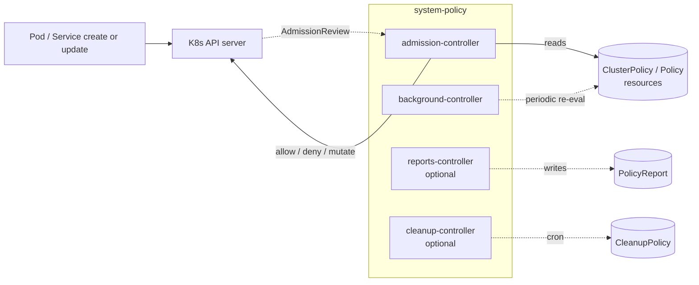

# Policy

Kyverno is the cluster's admission policy engine. The `policy-base`
Kustomization installs the Kyverno controllers; `policy-resources` applies
the ClusterPolicy resources that enforce or audit cluster-wide rules.

This stack is depended on by nearly every other stack — the namespace runs
at PSA `baseline` and the cluster's mutation policies (private-CA injection,
LBIPAM IP sharing on Cilium gateways, docker-desktop DNS rewriting) all
require Kyverno's CRDs to apply.

## Flow



The `admission-controller` and `background-controller` always run when
`policy-base` is installed. The `reports-controller` and `cleanup-controller`
are off by default — they ship with the chart but are toggled on by
`kyverno/reports` and `kyverno/cleanup` components when the operator opts in.

## Recipes

`policy-base` and `policy-resources` are gated on `policies.enabled` (default
`true`). Setting `policies.enabled: false` skips both Kustomizations entirely;
this is the opt-out for clusters that don't want admission control. It will
break stacks that depend on `policy-resources` to install ClusterPolicies, so
review consumers before disabling.

### Default (admission + background only)

Most clusters land here. `require-image-digest` enforces SHA256 digests on
all pods in `system-*` namespaces; `resource-limits-requests` audits.

```yaml
- name: policy-base
  path: policy/base
  components:
    - kyverno
  timeout: 30m
  interval: 5m

- name: policy-resources
  path: policy/resources
  dependsOn: [policy-base]
  components:
    - kyverno/resource-limits-requests
    - kyverno/require-image-digest
  timeout: 5m
  interval: 5m
  retryInterval: 1m
```

### With reports and cleanup controllers

Layer in the optional controllers when the operator wants
PolicyReport / ClusterPolicyReport visibility (`policies.reporting: enabled`)
or CleanupPolicy / ClusterCleanupPolicy CRD execution
(`policies.cleanup: enabled`).

```yaml
- name: policy-base
  path: policy/base
  components:
    - kyverno
    - kyverno/reports
    - kyverno/cleanup

- name: policy-resources
  path: policy/resources
  dependsOn: [policy-base]
  components:
    - kyverno/resource-limits-requests
    - kyverno/require-image-digest
```

### Disabling individual policies

Keep Kyverno installed but skip a specific ClusterPolicy by setting
`policies.resource_limits_requests: disabled` or
`policies.require_image_digest: disabled` in the context values; the facet
drops the corresponding component from `policy-resources.components`.

## Substitutions

This stack does not consume any blueprint substitutions. Policy bodies are
hardcoded; gating happens at the component-selection layer in
`platform-base`.

## Components

### `policy/base/`

| Component | Enable when | Effect |
|---|---|---|
| `kyverno` | `policies.enabled` | Helm release of Kyverno v3.8.0 in `system-policy`. Installs admission-controller and background-controller. CRDs migrate via the chart's migration job. cleanup-controller and reports-controller are present but disabled (`enabled: false` in values). |
| `kyverno/cleanup` | `policies.cleanup == 'enabled'` | Patches the kyverno HelmRelease to set `cleanupController.enabled: true`. The controller stays idle until CleanupPolicy / ClusterCleanupPolicy resources are created. |
| `kyverno/reports` | `policies.reporting == 'enabled'` | Patches the kyverno HelmRelease to set `reportsController.enabled: true`. Adds background scans and emits PolicyReport / ClusterPolicyReport resources. Admission enforcement is unaffected. |

### `policy/resources/`

The base kustomization is empty by default — every policy is its own
component. Ordering is irrelevant since each ClusterPolicy is independent.

| Component | Enable when | Effect |
|---|---|---|
| `kyverno/require-image-digest` | `policies.require_image_digest != 'disabled'` | `ClusterPolicy/require-image-digest` (Enforce, background-on). Validates that every container image in `system-*` namespaces or namespaces labeled `policy.windsorcli.dev/managed: "true"` is pinned by `@sha256:digest`. Excludes namespaces labeled `policy.windsorcli.dev/managed: "false"`. |
| `kyverno/resource-limits-requests` | `policies.resource_limits_requests != 'disabled'` | `ClusterPolicy/resource-limits-requests` (Audit, background-off). Checks every Pod in `system-*` namespaces has CPU and memory `requests` and `limits`. `kube-system` is excluded via `preconditions`. Audit means failures are logged via PolicyReport but do not block admission. |

## Dependencies

`policy-base` has no `dependsOn` — it must come up before nearly everything
else. The Kyverno admission webhook intercepts every Pod creation, so any
stack that depends on `policy-resources` is also implicitly waiting for
admission webhooks to be ready (Flux's `dependsOn` on a Kustomization waits
for the contained HelmRelease to reconcile, which waits for the chart's own
readiness checks).

`policy-resources` depends on `policy-base` (the Kyverno CRDs must exist
before any ClusterPolicy is applied).

Stacks that depend on `policy-resources`:

- `pki-base` — when policies are enabled, pki-base waits so cert-manager pods come up after Kyverno admission is enforcing image-digest pinning (otherwise cert-manager pods would be admitted without digests on first reconcile and rejected on rollout).
- `pki-resources` — `addon-private-ca` ships an `inject-private-ca` ClusterPolicy; without `policy-resources` the Kyverno CRDs aren't ready and the apply fails on `no matches for kind ClusterPolicy`.
- `dns` — `addon-private-dns` ships `external-dns/localhost`'s ClusterPolicy on docker-desktop runtime.
- `cni` — re-rolls Cilium pods after Kyverno admission is live; when Cilium is the gateway driver, also depends on policy-resources for the LBIPAM sharing ClusterPolicy in `cilium/gateway`.
- `lb-base` — every platform that wires lb-base lists policy-resources as a dependency. The `system-lb` namespace runs at PSA `privileged` and Kyverno needs to be aware of it.
- `csi` — `option-storage` lists policy-resources as a dependency so CSI's node-driver-registrar Pod admits cleanly under image-digest enforcement.

## Operations

Stack-specific failure modes; generic Flux/Renovate behaviour is documented
at the repo level.

- **Pod creation failing with `image must include @sha256 digest`** — `require-image-digest` is enforcing on a workload that doesn't pin its image. Either pin the image (preferred) or label the workload's namespace `policy.windsorcli.dev/managed: "false"` to opt out. Renovate's `# renovate: datasource=docker depName=...` markers above the `tag:` value let Renovate maintain pinned `tag@sha256:...` entries automatically.
- **`HelmRelease/<anything>` reports `no matches for kind ClusterPolicy` or `Bundle`** — the consuming stack's `dependsOn` on `policy-resources` is missing or `policies.enabled` is false. Either restore the dep or accept that the dependent stack won't apply.
- **PolicyReports not appearing despite policies on** — the `reports-controller` is off by default. Set `policies.reporting: enabled` to layer in the `kyverno/reports` component.
- **Kyverno webhook causes API requests to time out** — the admission-controller is unhealthy. Check `kubectl get validatingwebhookconfiguration kyverno-resource-validating-webhook-cfg`; if the webhook is `failurePolicy: Fail` and Kyverno is down, every API write blocks. The Windsor helm-release values do not override `failurePolicy`; whatever the upstream chart and individual policies set applies. Review the per-policy `failurePolicy` carefully before adding new policies in `Enforce` mode.

## Security

- The `system-policy` namespace runs at PSA `baseline`.
- Kyverno's controllers run with the chart's default RBAC: cluster-wide read on most resources (to evaluate policies), write on PolicyReport/ClusterPolicyReport (when reports-controller is on), and the validating/mutating admission webhooks are cluster-scoped.
- Policy scope is gated on namespace labels:
  - In-scope: namespaces matching `system-*` or labeled `policy.windsorcli.dev/managed: "true"`.
  - Out-of-scope: namespaces labeled `policy.windsorcli.dev/managed: "false"` (explicit opt-out, takes precedence over inclusion).
- All container images in `system-*` namespaces (every Windsor-managed system stack) must be `@sha256:` pinned. Renovate handles this automatically through the `# renovate:` markers in helm-release values.

## See also

- [contexts/_template/facets/platform-base.yaml](../../contexts/_template/facets/platform-base.yaml) — canonical wiring of `policy-base` and `policy-resources`, including conditional toggles for the optional controllers and per-policy gates.
- [contexts/_template/facets/addon-private-ca.yaml](../../contexts/_template/facets/addon-private-ca.yaml) — example of a stack that ships a ClusterPolicy and `dependsOn: policy-resources`.
- Blueprint schema and facet syntax — https://www.windsorcli.dev/docs/blueprints/
- Related stacks: [pki](../pki/), [cni](../cni/), [lb](../lb/), [dns](../dns/), [gateway](../gateway/).
