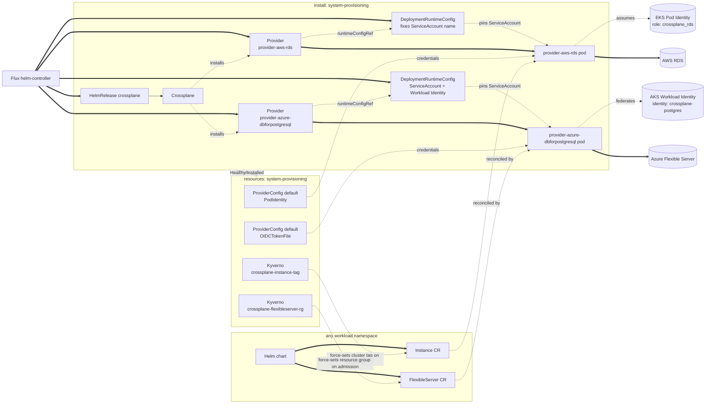

# Provisioning

A Kubernetes-native API for cloud-managed resources, installed so a Helm
chart running on top of core can request one without the customer
authoring their own Windsor blueprint. Today this covers a single
capability — a cloud-managed Postgres database, gated on
`database.postgres.driver == 'rds'` (AWS) or `== 'flexibleserver'` (Azure)
(see [kustomize/database](../database/README.md)) — implemented with
Crossplane and `provider-aws-rds` or `provider-azure-dbforpostgresql`,
installed the same way `pki` installs cert-manager or `policy` installs
kyverno: a capability domain naming what it provides, a vendor tool
underneath.

The add-on installs Crossplane, the provider package for the active
driver, and a `ProviderConfig` wired to that cloud's credentials. It
creates no database. A chart installed on top of core creates the actual
`rds.aws.upbound.io/v1beta3` `Instance` or
`dbforpostgresql.azure.upbound.io/v1beta1` `FlexibleServer` directly — the
same posture as CloudNativePG's `Cluster` CR in `kustomize/database`.

`system-provisioning` runs at PSA `baseline`, matching `system-database`.
The Crossplane chart's own `securityContext` values are hardened past the
chart defaults (`capabilities.drop: [ALL]`, `seccompProfile:
RuntimeDefault`) — enough to satisfy `restricted`, verified with
`kustomize build`. The provider pod (`provider-aws-rds`, via
`DeploymentRuntimeConfig`) isn't: `deploymentTemplate.spec` requires a
`selector` matching pod template labels Crossplane assigns dynamically
per revision, so a correct override isn't safely hand-writable without
deeper visibility into Crossplane's own labeling — confirmed against a
live cluster, not just `kustomize build`. `restricted` for this namespace
is a real follow-up, not decided here. `provider-azure-dbforpostgresql`'s
own runtime pod carries the same unresolved constraint; it hasn't been
checked against a live cluster yet.

## Architecture



The `provisioning` `flux:` system entry that turns this on lives in
`addon-database.yaml`, one entry per driver, gated on
`database.postgres.driver` — the same cross-domain-entry-in-a-driving-facet
shape that facet's `observability` entry already uses to target
`kustomize/observability/`. `install:` carries the HelmRelease plus the
`Provider` and `DeploymentRuntimeConfig` CRs — safe there because
Crossplane's chart applies its own core CRDs via an init container on
every install and upgrade, so the HelmRelease can't go Ready before they
exist. `resources:` carries the `ProviderConfig` and the Kyverno policy:
neither provider's own CRD is registered until Crossplane's package
manager finishes installing it, which is exactly what `install:`'s
`healthCheckExprs` on the
`Provider`'s Healthy/Installed condition waits for — no explicit
`dependsOn` needed, the ordinary install-before-resources edge already
guarantees it. `install/crossplane/aws-rds` and
`resources/crossplane/aws-rds` (and their `azure-postgres` twins) share
the same leaf name on purpose, matching `csi/install/longhorn` and
`csi/resources/longhorn` — same provider, split by lifecycle stage.

Every driver's admin password writes straight into a Kubernetes `Secret`
via `autoGeneratePassword: true` (Crossplane-generated for RDS/Flexible
Server, Terraform-generated for Cloud SQL, which has no such mechanism of
its own). The shared `bootstrap` ServiceAccount (`kustomize/database`'s
`crossplane/postgres`) reads it — a plain ServiceAccount
with no cloud credential, identical across drivers.

## Consuming from a chart

Once enabled, a chart needs only the database definition — no provider
wiring, no credentials.

AWS (`database.postgres.driver == 'rds'`):

```yaml
apiVersion: rds.aws.upbound.io/v1beta3
kind: Instance
metadata:
  name: my-app-db
spec:
  forProvider:
    region: us-east-1
    engine: postgres
    instanceClass: db.t4g.micro
    dbSubnetGroupName: <cluster-name>-crossplane-rds
    # ...
```

`providerConfigRef` is omitted — `default` is the field's own default, and
that's the name of the `ProviderConfig` this add-on creates. No
`windsorcli.dev/cluster` tag either: `resources/crossplane/aws-rds`
bundles a Kyverno `ClusterPolicy` that force-sets it on every `Instance`
admission, overwriting whatever value (if any) the chart submitted. The
`crossplane_rds` IAM role's policy conditions `CreateDBInstance` on that
request tag and `ModifyDBInstance`/`DeleteDBInstance` on the same resource
tag, so the role can't touch an RDS instance it didn't create — the chart
author never needs to know this tag exists.

Azure (`database.postgres.driver == 'flexibleserver'`):

```yaml
apiVersion: dbforpostgresql.azure.upbound.io/v1beta1
kind: FlexibleServer
metadata:
  name: my-app-db
spec:
  forProvider:
    location: eastus
    version: "16"
    delegatedSubnetId: <network-output>
    privateDnsZoneId: <database-output>
    administratorLogin: myapp
    administratorPasswordSecretRef:
      name: my-app-db-admin-credentials
      namespace: system-provisioning
      key: password
    autoGeneratePassword: true
---
apiVersion: dbforpostgresql.azure.upbound.io/v1beta1
kind: FlexibleServerDatabase
metadata:
  name: myapp
spec:
  forProvider:
    name: myapp
    serverIdRef:
      name: my-app-db
```

The database is a separate CR from the server — `FlexibleServer` carries
no `dbName` field the way `rds.aws.upbound.io` `Instance` does.
`resourceGroupName` is likewise omitted; `resources/crossplane/azure-postgres`
bundles a Kyverno `ClusterPolicy` that force-sets it on every
`FlexibleServer` admission to the context's dedicated postgres resource
group, the same overwrite-on-admission posture as the AWS tag policy.
`crossplane-identity-azure`'s custom role is scoped to that resource
group, so the identity can't touch a server it didn't create.

<!-- BEGIN_KUSTOMIZE_DOCS -->

## Components

| Component | Enable when | Effect |
|---|---|---|
| `crossplane` | `database.postgres.driver == 'rds'` OR `database.postgres.driver == 'flexibleserver'` OR `database.postgres.driver == 'cloudsql'` | Helm release of Crossplane in `system-provisioning`. Generic engine mechanics only — a driver's own database-specific consumption of it (ProviderConfig, monitoring, app-role) lives in `kustomize/database` instead, in `system-database`. |
| `crossplane/provider-sql` | `database.postgres.driver == 'rds'` OR `database.postgres.driver == 'flexibleserver'` OR `database.postgres.driver == 'cloudsql'` | Digest-pinned `Provider` CR for `crossplane-contrib/provider-sql` plus a `DeploymentRuntimeConfig` setting its resource requests/limits. Installed once per context alongside whichever cloud provider is active — its `Role`/`Database`/`Grant` CRDs speak the Postgres wire protocol, not a cloud API, so the same install serves all three drivers' `app-role` components in `kustomize/database`. |
| `crossplane/function-python` | `database.postgres.driver == 'rds'` OR `database.postgres.driver == 'flexibleserver'` OR `database.postgres.driver == 'cloudsql'` | Digest-pinned `Function` CR for `crossplane-contrib/function-python` plus a `DeploymentRuntimeConfig` setting its resource requests/limits. Runs the `WatchOperation` pipeline `kustomize/database`'s `app-role` component uses to mirror an instance's connection details; requires Crossplane's `--enable-operations` alpha flag, set on this component's own `helm-release.yaml`. |
| `crossplane/aws-rds` | `database.postgres.driver == 'rds'` | Digest-pinned `Provider` CRs for `provider-aws-rds` (`skipDependencyResolution: true`) and its `provider-family-aws` dependency, plus a `DeploymentRuntimeConfig` that fixes the provider pod's ServiceAccount name to `provider-aws-rds` so the `provisioning/crossplane-identity/aws` Terraform module's Pod Identity association can target it. Its own database-specific consumption (`ProviderConfig`, tag policy, monitoring, `app-role`) is `kustomize/database`'s `crossplane/aws-rds` component instead. |
| `crossplane/azure-postgres` | `database.postgres.driver == 'flexibleserver'` | Azure twin of `crossplane/aws-rds`. Digest-pinned `Provider` CRs for `provider-azure-dbforpostgresql` (`skipDependencyResolution: true`) and its `provider-family-azure` dependency, plus a `DeploymentRuntimeConfig` that fixes the provider pod's ServiceAccount name to `provider-azure-dbforpostgresql` and wires AKS Workload Identity (client-id/tenant-id annotations, the `azure.workload.identity/use` label on both the ServiceAccount and the pod) so the `provisioning/crossplane-identity/azure` Terraform module's federated credential can target it. |
| `crossplane/gcp-cloudsql` | `database.postgres.driver == 'cloudsql'` | GCP twin of `crossplane/aws-rds`. Digest-pinned `Provider` CRs for `provider-gcp-sql` (`skipDependencyResolution: true`) and its `provider-family-gcp` dependency, plus a `DeploymentRuntimeConfig` that wires GKE Workload Identity (the `iam.gke.io/gcp-service-account` annotation on the provider ServiceAccount) so the `provisioning/crossplane-identity/gcp` Terraform module's Workload Identity binding can target it. |

<!-- END_KUSTOMIZE_DOCS -->

## See also

- [contexts/_template/facets/addon-database.yaml](../../contexts/_template/facets/addon-database.yaml) for the `provisioning` `flux:` system entries.
- [terraform/cluster/aws-eks](../../terraform/cluster/aws-eks/), [terraform/database/aws-rds](../../terraform/database/aws-rds/), [terraform/provisioning/crossplane-iam](../../terraform/provisioning/crossplane-iam/) for the AWS IAM role, Pod Identity association, and DB subnet group.
- [terraform/database/azure-postgres](../../terraform/database/azure-postgres/), [terraform/provisioning/crossplane-identity-azure](../../terraform/provisioning/crossplane-identity-azure/) for the Azure resource group, private DNS zone, and Workload Identity federation.
- Related add-ons: [database](../database/) (the `database.postgres.driver` gate).
