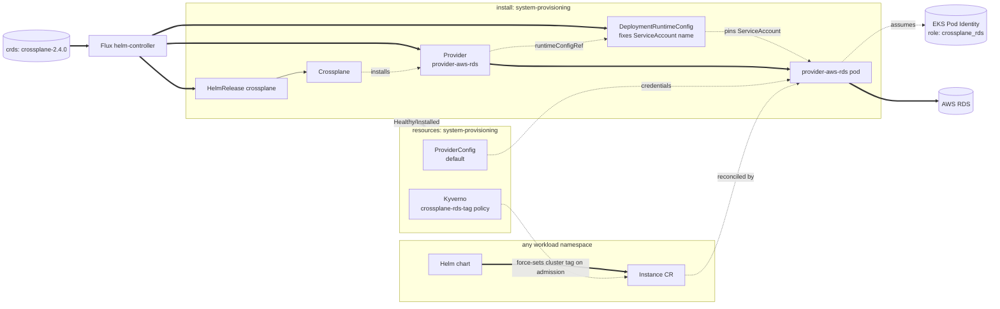

# Provisioning

A Kubernetes-native API for cloud-managed resources, installed so a Helm
chart running on top of core can request one without the customer
authoring their own Windsor blueprint. Today this covers a single
capability — a cloud-managed Postgres database, gated on
`database.postgres.driver == 'rds'` (see
[kustomize/database](../database/README.md)) — implemented with Crossplane
and `provider-aws-rds`, installed the same way `pki` installs cert-manager
or `policy` installs kyverno: a capability domain naming what it provides,
a vendor tool underneath.

The add-on installs Crossplane, the `provider-aws-rds` package, and a
`ProviderConfig` wired to AWS credentials. It creates no database. A chart
installed on top of core creates the actual `rds.aws.upbound.io/v1beta3`
`Instance` directly — the same posture as CloudNativePG's `Cluster` CR in
`kustomize/database`.

`system-provisioning` runs at PSA `baseline`, matching `system-database`.
The Crossplane chart's own `securityContext` values are hardened past the
chart defaults (`capabilities.drop: [ALL]`, `seccompProfile:
RuntimeDefault`) — enough to satisfy `restricted`, verified with
`kustomize build`. The provider pod (`provider-aws-rds`, via
`DeploymentRuntimeConfig`) isn't: `deploymentTemplate.spec` requires a
`selector` matching pod template labels Crossplane assigns dynamically
per revision, so a correct override isn't safely hand-writable without
deeper visibility into Crossplane's own labeling — confirmed against a
live cluster, not just `kustomize build`. `restricted` for this namespace
is a real follow-up, not decided here.

## Architecture



The `provisioning` `flux:` system entry that turns this on lives in
`addon-database.yaml`, gated on `database.postgres.driver == 'rds'` — the
same cross-domain-entry-in-a-driving-facet shape that facet's
`observability` entry already uses to target `kustomize/observability/`.
`install:` carries the HelmRelease plus the `Provider` and
`DeploymentRuntimeConfig` CRs — safe there because Crossplane's own CRDs
are vendored under `kustomize/crds/crossplane-2.4.0`, ahead of `install:`,
the same as any other operator's CRDs. `resources:` carries the
`ProviderConfig` and the Kyverno tag policy: `provider-aws-rds`'s own CRD
isn't registered until Crossplane's package manager finishes installing
it, which is exactly what `install:`'s `healthCheckExprs` on the
`Provider`'s Healthy/Installed condition waits for — no explicit
`dependsOn` needed, the ordinary install-before-resources edge already
guarantees it. `install/crossplane/aws-rds` and
`resources/crossplane/aws-rds` share the same leaf name on purpose,
matching `csi/install/longhorn` and `csi/resources/longhorn` — same
provider, split by lifecycle stage.

## Consuming from a chart

Once enabled, a chart needs only the database definition — no provider
wiring, no credentials:

```yaml
apiVersion: rds.aws.upbound.io/v1beta3
kind: Instance
metadata:
  name: my-app-db
spec:
  forProvider:
    region: us-east-1
    engine: postgres
    instanceClass: db.t4g.micro
    dbSubnetGroupName: <cluster-name>-crossplane-rds
    # ...
```

`providerConfigRef` is omitted — `default` is the field's own default, and
that's the name of the `ProviderConfig` this add-on creates. No
`windsorcli.dev/cluster` tag either: `resources/crossplane/aws-rds`
bundles a Kyverno `ClusterPolicy` that force-sets it on every `Instance`
admission, overwriting whatever value (if any) the chart submitted. The
`crossplane_rds` IAM role's policy conditions `CreateDBInstance` on that
request tag and `ModifyDBInstance`/`DeleteDBInstance` on the same resource
tag, so the role can't touch an RDS instance it didn't create — the chart
author never needs to know this tag exists.

<!-- BEGIN_KUSTOMIZE_DOCS -->

## Components

| Component | Enable when | Effect |
|---|---|---|
| `crossplane` | `database.postgres.driver == 'rds'` | Helm release of Crossplane in `system-provisioning`. |
| `crossplane/aws-rds` | `database.postgres.driver == 'rds'` | In `install:`: digest-pinned `Provider` CRs for `provider-aws-rds` (`skipDependencyResolution: true`) and its `provider-family-aws` dependency, plus a `DeploymentRuntimeConfig` that fixes the provider pod's ServiceAccount name to `provider-aws-rds` so the cluster/aws-eks Terraform module's Pod Identity association can target it. In `resources:`, once the Provider reports Healthy/Installed: the `default` `ProviderConfig` (credentials source `PodIdentity`, so a consuming `Instance` CR needs no `providerConfigRef`), plus a Kyverno `ClusterPolicy` that force-sets the `windsorcli.dev/cluster` tag on every `Instance`. |

<!-- END_KUSTOMIZE_DOCS -->

## See also

- [contexts/_template/facets/addon-database.yaml](../../contexts/_template/facets/addon-database.yaml) for the `provisioning` `flux:` system entry.
- [terraform/cluster/aws-eks](../../terraform/cluster/aws-eks/) for the `crossplane_rds` IAM role, Pod Identity association, and DB subnet group.
- Related add-ons: [database](../database/) (the `database.postgres.driver` gate).
