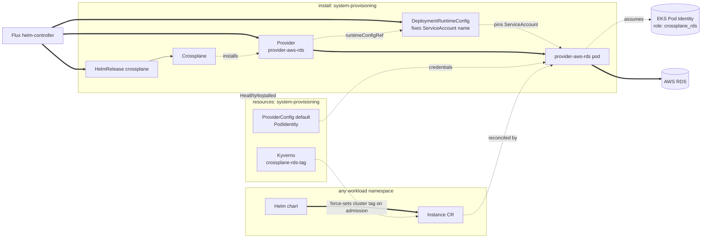

Installs Crossplane and `provider-aws-rds` in `system-provisioning`, so a
chart running on top of core can request an RDS Postgres instance
without a Windsor blueprint of its own. Enabled when
`database.postgres.driver == 'rds'`. It creates no database — a chart
installed on top of core creates the actual `rds.aws.upbound.io/v1beta3`
`Instance` directly, the same posture as CloudNativePG's `Cluster` CR in
[Kustomize — Database](../../../database/README.md).

`system-provisioning` runs at PSA `baseline`, matching `system-database`.
The Crossplane chart's own `securityContext` values are hardened past
the chart defaults (`capabilities.drop: [ALL]`, `seccompProfile:
RuntimeDefault`) — enough to satisfy `restricted`, verified with
`kustomize build`. The `provider-aws-rds` pod (via
`DeploymentRuntimeConfig`) isn't: `deploymentTemplate.spec` requires a
`selector` matching pod template labels, and Crossplane assigns those
labels dynamically per revision, so a correct override isn't safely
hand-writable without deeper visibility into Crossplane's own labeling —
confirmed against a live cluster, not just `kustomize build`.

## Architecture



`install/crossplane/aws-rds` and `resources/crossplane/aws-rds` share
the same leaf name on purpose, mirroring `csi/install/longhorn` and
`csi/resources/longhorn`: same provider, split by lifecycle stage.
`install:` carries the HelmRelease plus the `Provider` and
`DeploymentRuntimeConfig` CRs — safe there because Crossplane's chart
applies its own core CRDs via an init container on every install and
upgrade, so the HelmRelease can't go Ready before they exist.
`resources:` carries the `ProviderConfig` and the Kyverno
tag policy, gated on the `Provider`'s Healthy/Installed condition — no
explicit `dependsOn` is needed, since the ordinary install-before-
resources edge already guarantees it.

## Consuming from a chart

Once enabled, a chart needs only the database definition — no provider
wiring, no credentials:

```yaml
apiVersion: rds.aws.upbound.io/v1beta3
kind: Instance
metadata:
  name: my-app-db
spec:
  forProvider:
    region: us-east-1
    engine: postgres
    instanceClass: db.t4g.micro
    dbSubnetGroupName: <cluster-name>-crossplane-rds
    # ...
```

`providerConfigRef` is omitted — `default` is the field's own default,
and that's the name of the `ProviderConfig` this add-on creates. No
`windsorcli.dev/cluster` tag either: `resources/crossplane/aws-rds`
bundles a Kyverno `ClusterPolicy` that force-sets it on every `Instance`
admission, overwriting whatever value (if any) the chart submitted. The
`crossplane_rds` IAM role's policy conditions `CreateDBInstance` on that
request tag and `ModifyDBInstance`/`DeleteDBInstance` on the same
resource tag, so the role can't touch an RDS instance it didn't create.

## Components

### `crossplane/aws-rds`

In `install:`: digest-pinned `Provider` CRs for `provider-aws-rds`
(`skipDependencyResolution: true`) and its `provider-family-aws`
dependency, plus a `DeploymentRuntimeConfig` that fixes the provider
pod's ServiceAccount name to `provider-aws-rds` so the
[Crossplane IAM](../../../../terraform/provisioning/crossplane-identity/aws/) Terraform
module's Pod Identity association can target it. In `resources:`, once
the Provider reports Healthy/Installed: the `default` `ProviderConfig`
(credentials source `PodIdentity`, so a consuming `Instance` CR needs no
`providerConfigRef`), a Kyverno `ClusterPolicy` that force-sets the
`windsorcli.dev/cluster` tag on every `Instance`, the `rds-secret-reader`
ServiceAccount `app-role` (below) and the monitoring `ClusterPolicy`s use
to provision scoped credentials from the RDS-managed master password, a
static `Role`/`RoleBinding` granting it access to every
monitor-credentials `Secret` in `system-provisioning`, and two
`generate` `ClusterPolicy`s that automatically provision `pg_monitor`
monitoring (the role, plus the per-Instance `ClusterRole`/
`ClusterRoleBinding` letting `rds-secret-reader` read that Instance's
status) for every `Instance` in the cluster — no chart opt-in, matching
CNPG's own free monitoring. A `ClusterRole` pair aggregates into
Kyverno's `background-controller`/`admission-controller`, the RBAC those
`generate` rules need. The `postgres_exporter` Deployment/Service/
PodMonitor itself is the separate `monitoring-exporter` component below.

### `crossplane/aws-rds/app-role`

_Enabled when a chart opts in — see `kustomize/demo/resources/database/rds`
for the worked example._

Reusable application-credential provisioning for any `provider-aws-rds`
`Instance` — the role owns its database, matching CNPG's own default
`app` user, so a chart can migrate its own schema without its own
CronJob. A `ClusterRole`/`Role` opting `rds-secret-reader` into the
named `Instance` and an app `Secret`, a one-shot `Job` that runs the
provisioning script immediately on apply, and a `CronJob` running the
identical script every 5 minutes for ongoing self-healing. Both
idempotently create `<pg_database_name>_app`, transfer database
ownership to it, and run the chart's optional `pg_grant_sql` for
anything ownership doesn't cover, publishing
`<pg_instance_name>-app-credentials` — never the master credential
itself. Requires `pg_instance_name`, `pg_database_name`, and
`pg_target_namespace`; `pg_grant_sql` (one line — Flux substitution is
literal text, so a multi-line value would corrupt the Job/CronJob's
YAML) is optional, from the consuming facet.

### `crossplane/aws-rds/monitoring-exporter`

_Enabled when `database.postgres.driver == 'rds'` AND
`telemetry.metrics.enabled` (default true)._

A `generate` `ClusterPolicy` that automatically provisions a
`postgres_exporter` Deployment/Service/PodMonitor in `system-provisioning`
for every `Instance` in the cluster, scraping the `pg_monitor` role
`crossplane/aws-rds`'s own generate policies provision. Split from
`crossplane/aws-rds` because `PodMonitor` (`monitoring.coreos.com/v1`)
only exists once the metrics pipeline vendors prometheus-operator's
CRDs.

## See also

- [contexts/_template/facets/addon-database.yaml](../../../../contexts/_template/facets/addon-database.yaml) for the `provisioning` `flux:` system entry.
- [Terraform — AWS RDS](../../../../terraform/database/aws-rds/), [Terraform — Crossplane IAM](../../../../terraform/provisioning/crossplane-identity/aws/) for the KMS key, security group, and Pod Identity role this depends on.
- [Kustomize — Database](../../../database/README.md) for CloudNativePG, the in-cluster alternative this add-on doesn't replace.
