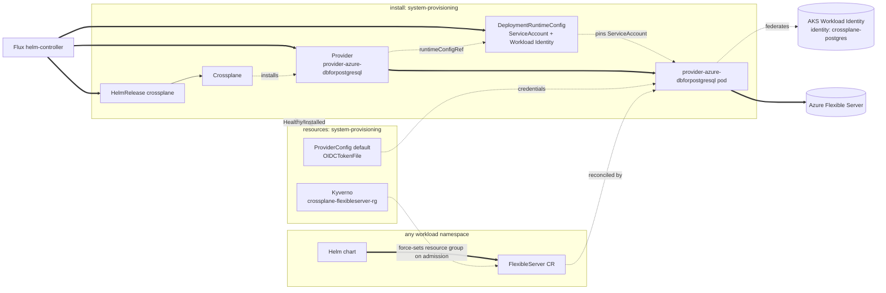

Installs Crossplane and `provider-azure-dbforpostgresql` in
`system-provisioning`, so a chart running on top of core can request an
Azure Database for PostgreSQL Flexible Server without a Windsor
blueprint of its own. Enabled when
`database.postgres.driver == 'flexibleserver'`. It creates no database —
a chart installed on top of core creates the actual
`dbforpostgresql.azure.upbound.io/v1beta1` `FlexibleServer` directly,
the same posture as CloudNativePG's `Cluster` CR in
[Kustomize — Database](../../../database/README.md).

`system-provisioning` runs at PSA `baseline`, matching `system-database`.
The Crossplane chart's own `securityContext` values are hardened past
the chart defaults (`capabilities.drop: [ALL]`, `seccompProfile:
RuntimeDefault`) — enough to satisfy `restricted`, verified with
`kustomize build`. The `provider-azure-dbforpostgresql` pod (via
`DeploymentRuntimeConfig`) isn't: `deploymentTemplate.spec` requires a
`selector` matching pod template labels, and Crossplane assigns those
labels dynamically per revision, so a correct override isn't safely
hand-writable without deeper visibility into Crossplane's own labeling —
confirmed against a live cluster, not just `kustomize build`.

## Architecture



`install/crossplane/azure-postgres` and `resources/crossplane/azure-postgres`
share the same leaf name on purpose, mirroring `csi/install/longhorn`
and `csi/resources/longhorn`: same provider, split by lifecycle stage.
`install:` carries the HelmRelease plus the `Provider` and
`DeploymentRuntimeConfig` CRs — safe there because Crossplane's chart
applies its own core CRDs via an init container on every install and
upgrade, so the HelmRelease can't go Ready before they exist.
`resources:` carries the `ProviderConfig` and the Kyverno
resource-group policy, gated on the `Provider`'s Healthy/Installed
condition — no explicit `dependsOn` is needed, since the ordinary
install-before-resources edge already guarantees it.

## Consuming from a chart

Once enabled, a chart needs only the database definition — no provider
wiring, no credentials:

```yaml
apiVersion: dbforpostgresql.azure.upbound.io/v1beta1
kind: FlexibleServer
metadata:
  name: my-app-db
spec:
  forProvider:
    location: eastus
    version: "16"
    delegatedSubnetId: <network-output>
    privateDnsZoneId: <database-output>
    administratorLogin: myapp
    administratorPasswordSecretRef:
      name: my-app-db-admin-credentials
      namespace: system-provisioning
      key: password
    autoGeneratePassword: true
---
apiVersion: dbforpostgresql.azure.upbound.io/v1beta1
kind: FlexibleServerDatabase
metadata:
  name: myapp
spec:
  forProvider:
    name: myapp
    serverIdRef:
      name: my-app-db
```

The database is a separate CR from the server — `FlexibleServer` carries
no `dbName` field the way `rds.aws.upbound.io` `Instance` does.
`resourceGroupName` is likewise omitted; `resources/crossplane/azure-postgres`
bundles a Kyverno `ClusterPolicy` that force-sets it on every
`FlexibleServer` admission to the context's dedicated postgres resource
group, the same overwrite-on-admission posture as AWS's tag policy.
[Crossplane Identity (Azure)](../../../../terraform/provisioning/crossplane-identity/azure/)'s
custom role is scoped to that resource group, so the identity can't
touch a server it didn't create.

## Components

### `crossplane/azure-postgres`

Azure twin of `crossplane/aws-rds`. In `install:`: digest-pinned
`Provider` CRs for `provider-azure-dbforpostgresql`
(`skipDependencyResolution: true`) and its `provider-family-azure`
dependency, plus a `DeploymentRuntimeConfig` that fixes the provider
pod's ServiceAccount name to `provider-azure-dbforpostgresql` and wires
AKS Workload Identity (client-id/tenant-id annotations, the
`azure.workload.identity/use` label on both the ServiceAccount and the
pod) so the
[Crossplane Identity (Azure)](../../../../terraform/provisioning/crossplane-identity/azure/)
Terraform module's federated credential can target it. In `resources:`,
once the Provider reports Healthy/Installed: the `default`
`ProviderConfig` (credentials source `OIDCTokenFile`, so a consuming
`FlexibleServer` CR needs no `providerConfigRef`), a Kyverno
`ClusterPolicy` that force-sets `resourceGroupName` on every
`FlexibleServer` to the context's dedicated postgres resource group, the
`flexibleserver-bootstrap` ServiceAccount `app-role` (below) and the
monitoring `ClusterPolicy`s use to provision scoped credentials from the
admin credential Secret Crossplane itself generates (no cloud
secret-store bootstrap needed, unlike RDS), a static `Role`/`RoleBinding`
granting it access to every admin/monitor-credentials `Secret` in
`system-provisioning`, and two `generate` `ClusterPolicy`s that
automatically provision `pg_monitor` monitoring (the role, plus the
per-server `ClusterRole`/`ClusterRoleBinding` letting
`flexibleserver-bootstrap` read that server's status) for every
`FlexibleServer` in the cluster — no chart opt-in, matching CNPG's own
free monitoring. A `ClusterRole` pair aggregates into Kyverno's
`background-controller`/`admission-controller`, the RBAC those
`generate` rules need. The `postgres_exporter` Deployment/Service/
PodMonitor itself is the separate `monitoring-exporter` component below.

### `crossplane/azure-postgres/app-role`

_Enabled when a chart opts in — see
`kustomize/demo/resources/database/flexibleserver` for the worked
example._

Reusable application-credential provisioning for any
`provider-azure-dbforpostgresql` `FlexibleServer` — the role owns its
database, matching CNPG's own default `app` user, so a chart can migrate
its own schema without its own CronJob. A `ClusterRole`/`Role` opting
`flexibleserver-bootstrap` into the named `FlexibleServer` and an app
`Secret`, a one-shot `Job` that runs the provisioning script immediately
on apply, and a `CronJob` running the identical script every 5 minutes
for ongoing self-healing. Both idempotently create
`<pg_database_name>_app`, transfer database ownership to it, and run the
chart's optional `pg_grant_sql` for anything ownership doesn't cover,
publishing `<pg_instance_name>-app-credentials` — never the admin
credential itself. Requires `pg_instance_name`, `pg_database_name`, and
`pg_target_namespace`; `pg_grant_sql` (one line — Flux substitution is
literal text, so a multi-line value would corrupt the Job/CronJob's
YAML) is optional, from the consuming facet.

### `crossplane/azure-postgres/monitoring-exporter`

_Enabled when `database.postgres.driver == 'flexibleserver'` AND
`telemetry.metrics.enabled` (default true)._

A `generate` `ClusterPolicy` that automatically provisions a
`postgres_exporter` Deployment/Service/PodMonitor in `system-provisioning`
for every `FlexibleServer` in the cluster, scraping the `pg_monitor`
role `crossplane/azure-postgres`'s own generate policies provision.
Split from `crossplane/azure-postgres` because `PodMonitor`
(`monitoring.coreos.com/v1`) only exists once the metrics pipeline
vendors prometheus-operator's CRDs.

## See also

- [contexts/_template/facets/addon-database.yaml](../../../../contexts/_template/facets/addon-database.yaml) for the `provisioning` `flux:` system entry.
- [Terraform — Azure Postgres](../../../../terraform/database/azure-postgres/), [Terraform — Crossplane Identity (Azure)](../../../../terraform/provisioning/crossplane-identity/azure/) for the resource group, private DNS zone, and Workload Identity federation this depends on.
- [Kustomize — Database](../../../database/README.md) for CloudNativePG, the in-cluster alternative this add-on doesn't replace.
