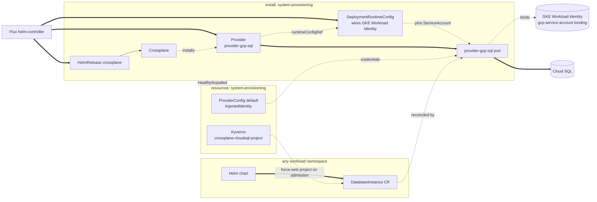

Installs Crossplane and `provider-gcp-sql` in `system-provisioning`, so
a chart running on top of core can request a Cloud SQL Postgres instance
without a Windsor blueprint of its own. Enabled when
`database.postgres.driver == 'cloudsql'`. It creates no database — a
chart installed on top of core creates the actual `DatabaseInstance`
directly, the same posture as CloudNativePG's `Cluster` CR in
[Kustomize — Database](../../../database/README.md).

`system-provisioning` runs at PSA `baseline`, matching `system-database`.
The Crossplane chart's own `securityContext` values are hardened past
the chart defaults (`capabilities.drop: [ALL]`, `seccompProfile:
RuntimeDefault`) — enough to satisfy `restricted`, verified with
`kustomize build`. The `provider-gcp-sql` pod (via
`DeploymentRuntimeConfig`) isn't: `deploymentTemplate.spec` requires a
`selector` matching pod template labels, and Crossplane assigns those
labels dynamically per revision, so a correct override isn't safely
hand-writable without deeper visibility into Crossplane's own labeling —
confirmed against a live cluster, not just `kustomize build`.

## Architecture

`install/crossplane/gcp-cloudsql` and `resources/crossplane/gcp-cloudsql`
share the same leaf name on purpose, mirroring `csi/install/longhorn`
and `csi/resources/longhorn`: same provider, split by lifecycle stage.
`install:` carries the HelmRelease plus the `Provider` and
`DeploymentRuntimeConfig` CRs — safe there because Crossplane's chart
applies its own core CRDs via an init container on every install and
upgrade, so the HelmRelease can't go Ready before they exist.
`resources:` carries the `ProviderConfig` and the Kyverno
project policy, gated on the `Provider`'s Healthy/Installed condition —
no explicit `dependsOn` is needed, since the ordinary
install-before-resources edge already guarantees it.

## Consuming from a chart

There's no worked YAML example here yet — the AWS and Azure sections
above have one each; this one doesn't. The `DatabaseInstance` CR comes
from `provider-gcp-sql`; see its own CRD reference for the exact shape
until a Cloud SQL example lands here.

`resources/crossplane/gcp-cloudsql` bundles a Kyverno `ClusterPolicy`
that force-sets `project` on every `DatabaseInstance` admission to the
context's GCP project, the same overwrite-on-admission posture as AWS's
tag policy and Azure's resource-group policy.

## Components

### `crossplane/gcp-cloudsql`

GCP twin of `crossplane/aws-rds`. In `install:`: digest-pinned
`Provider` CRs for `provider-gcp-sql` (`skipDependencyResolution: true`)
and its `provider-family-gcp` dependency, plus a `DeploymentRuntimeConfig`
that wires GKE Workload Identity (the `iam.gke.io/gcp-service-account`
annotation on the provider ServiceAccount) so the
[Crossplane Identity (GCP)](../../../../terraform/provisioning/crossplane-identity/gcp/)
Terraform module's Workload Identity binding can target it. In
`resources:`, once the Provider reports Healthy/Installed: the `default`
`ProviderConfig` (credentials source `InjectedIdentity`, so a consuming
`DatabaseInstance` CR needs no `providerConfigRef`), a Kyverno
`ClusterPolicy` that force-sets `project` on every `DatabaseInstance` to
the context's GCP project, the `cloudsql-bootstrap` ServiceAccount
`app-role` (below) and the monitoring `ClusterPolicy`s use to provision
scoped credentials from the admin credential Secret Terraform generates
(Cloud SQL's own `User` CR has no auto-generate mechanism for Postgres,
unlike RDS/Flexible Server), a static `Role`/`RoleBinding` granting it
access to every admin/monitor-credentials `Secret` in
`system-provisioning`, and two `generate` `ClusterPolicy`s that
automatically provision `pg_monitor` monitoring (the role, plus the
per-instance `ClusterRole`/`ClusterRoleBinding` letting
`cloudsql-bootstrap` read that instance's status) for every
`DatabaseInstance` in the cluster — no chart opt-in, matching CNPG's own
free monitoring. A `ClusterRole` pair aggregates into Kyverno's
`background-controller`/`admission-controller`, the RBAC those
`generate` rules need. The `postgres_exporter` Deployment/Service/
PodMonitor itself is the separate `monitoring-exporter` component below.

### `crossplane/gcp-cloudsql/app-role`

_Enabled when a chart opts in — see
`kustomize/demo/resources/database/cloudsql` for the worked example._

Reusable application-credential provisioning for any `provider-gcp-sql`
`DatabaseInstance` — the role owns its database, matching CNPG's own
default `app` user, so a chart can migrate its own schema without its
own CronJob. A `ClusterRole`/`Role` opting `cloudsql-bootstrap` into the
named `DatabaseInstance` and an app `Secret`, a one-shot `Job` that runs
the provisioning script immediately on apply, and a `CronJob` running
the identical script every 5 minutes for ongoing self-healing. Both
idempotently create `<pg_database_name>_app`, transfer database
ownership to it, and run the chart's optional `pg_grant_sql` for
anything ownership doesn't cover, publishing
`<pg_instance_name>-app-credentials` — never the admin credential
itself. Requires `pg_instance_name`, `pg_database_name`, and
`pg_target_namespace`; `pg_grant_sql` (one line — Flux substitution is
literal text, so a multi-line value would corrupt the Job/CronJob's
YAML) is optional, from the consuming facet.

### `crossplane/gcp-cloudsql/monitoring-exporter`

_Enabled when `database.postgres.driver == 'cloudsql'` AND
`telemetry.metrics.enabled` (default true)._

A `generate` `ClusterPolicy` that automatically provisions a
`postgres_exporter` Deployment/Service/PodMonitor in `system-provisioning`
for every `DatabaseInstance` in the cluster, scraping the `pg_monitor`
role `crossplane/gcp-cloudsql`'s own generate policies provision. Split
from `crossplane/gcp-cloudsql` because `PodMonitor`
(`monitoring.coreos.com/v1`) only exists once the metrics pipeline
vendors prometheus-operator's CRDs.

## See also

- [contexts/_template/facets/addon-database.yaml](../../../../contexts/_template/facets/addon-database.yaml) for the `provisioning` `flux:` system entry.
- [Terraform — GCP Cloud SQL](../../../../terraform/database/gcp-cloudsql/), [Terraform — Crossplane Identity (GCP)](../../../../terraform/provisioning/crossplane-identity/gcp/) for the private service connection, KMS key, and Workload Identity binding this depends on.
- [Kustomize — Database](../../../database/README.md) for CloudNativePG, the in-cluster alternative this add-on doesn't replace.
