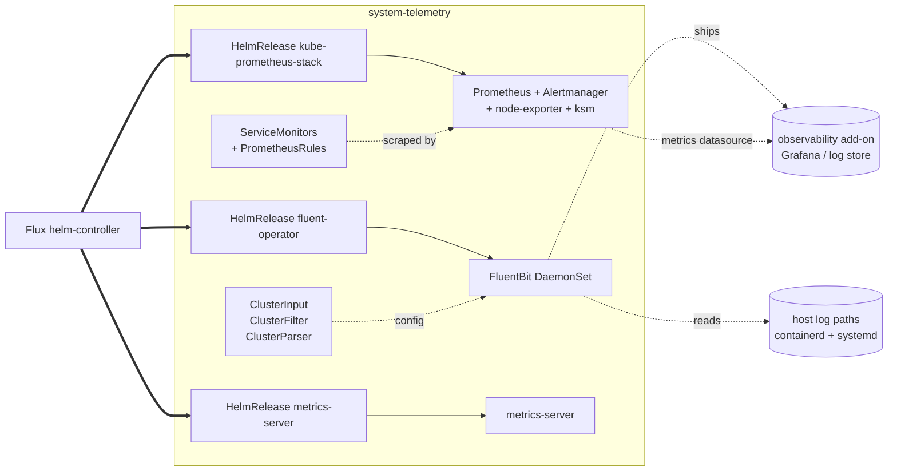

# Telemetry

The cluster's metrics and log-collection layer. Prometheus scrapes
workloads, and FluentBit ships logs to whatever downstream the
observability add-on wires up. Two flags drive it,
`telemetry.metrics.enabled` and `telemetry.logs.enabled`,
independently.

The add-on is a `flux:` system entry (`telemetry`) so Flux can install
the chart-level CRDs before the cluster-resource CRs that depend on
them. `install` ships the Helm releases (kube-prometheus-stack,
fluent-operator, filebeat as the Elasticsearch alternative).
`resources` ships ServiceMonitors, PrometheusRules, and the
ClusterFluentBitConfig / ClusterInput / ClusterFilter / ClusterParser
CRs, and implicitly depends on `install` (compiled name:
`telemetry-install` / `telemetry-resources`).

Component-name collisions are worth flagging. `prometheus`,
`prometheus/flux`, and `fluentbit` exist as components in BOTH tiers.
The same literal name points at the Helm release in `telemetry/install/`
and at the consuming CR set in `telemetry/resources/`. The descriptor
below disambiguates with `install/` and `resources/` prefixes. Facet
authors still write the bare names (`components: [prometheus]`), and
the prefix resolves from the tier.

The namespace runs at PSA `privileged` because some components
(FluentBit reading the host log path, metrics-server with host
networking) need it.

## Architecture



The install tier installs the Helm charts (Prometheus, FluentBit
operator, metrics-server). The resources tier wires up scrape targets
and collector configuration. The observability add-on attaches
Grafana on top of Prometheus and routes FluentBit's output to a log
store.

## Recipes

### Metrics only

```yaml
flux:
  - name: telemetry
    install:
      components: [prometheus, prometheus/flux, metrics-server]
      timeout: 30m
    resources:
      - components: [prometheus, prometheus/flux]
```

### Logs only

```yaml
flux:
  - name: telemetry
    install:
      components: [fluentbit]
    resources:
      - components:
          - fluentbit
          - fluentbit/containerd
          - fluentbit/kubernetes
          - fluentbit/parser
          - fluentbit/systemd
```

### Metrics + logs (default when both flags are on)

```yaml
flux:
  - name: telemetry
    install:
      components: [prometheus, prometheus/flux, fluentbit, metrics-server]
    resources:
      - components:
          - prometheus
          - prometheus/flux
          - fluentbit
          - fluentbit/containerd
          - fluentbit/kubernetes
          - fluentbit/parser
          - fluentbit/systemd
          - fluentbit/prometheus
```

### Elasticsearch-mode (filebeat replaces FluentBit)

When `addons.observability.logs_driver == 'elasticsearch'`, the
addon-observability facet declares `strategy: replace` on its own
`telemetry` system entry, overriding the whole system as one unit. The
install tier's `prometheus` and `prometheus/flux` components stay.
`fluentbit` is removed and `filebeat` is added.

<!-- BEGIN_KUSTOMIZE_DOCS -->

## Components — `telemetry-install`

| Component | Enable when | Effect |
|---|---|---|
| `install/prometheus` | `telemetry.metrics.enabled: true` | Helm release of `kube-prometheus-stack` (chart) in `system-telemetry`. Provides Prometheus, Alertmanager, node-exporter, kube-state-metrics. Grafana sub-chart is disabled (Grafana lives in the observability add-on). Chart CRD install is skipped; the prometheus-operator CRDs are vendored under `kustomize/crds/` and applied ahead of the controller via the facet `crds:` section. |
| `install/prometheus/flux` | `telemetry.metrics.enabled: true` | Patches the kube-prometheus-stack HelmRelease to scrape Flux controller metrics and enable the bundled Flux dashboards. |
| `install/fluentbit` | `telemetry.logs.enabled: true` | Helm release of the `fluent-operator` chart in `system-telemetry`. Installs the operator and a FluentBit DaemonSet on every node (chart CRD install is skipped). The operator's CRDs are vendored under `kustomize/crds/` and applied via the facet `crds:` section, so an operator teardown can't cascade-delete its CRs. The actual collector configuration ships as the `resources/fluentbit/*` components. |
| `install/filebeat` | `addons.observability.logs_driver == 'elasticsearch'` (telemetry-install is replaced) | Helm release of Elastic's Filebeat chart, used instead of FluentBit when Elasticsearch is the log driver. Wired by the `addon-observability` facet's `strategy: replace` override of telemetry-install. |
| `install/metrics-server` | `telemetry.metrics.enabled: true` AND `telemetry.metrics_server_enabled: true` | Helm release of `metrics-server` for `kubectl top` and HPA. Some platforms (EKS / AKS) ship a managed metrics-server; gate this off when one is already present. |
| `install/metrics-server/skip-tls` | default (when metrics-server is enabled in a cluster with selfsigned kubelet certs) | Patches the metrics-server Deployment to add `--kubelet-insecure-tls`. Required on Talos and other distros where kubelet serves cert-manager-issued or selfsigned certs. |

## Components — `telemetry-resources`

| Component | Enable when | Effect |
|---|---|---|
| `resources/prometheus` | `telemetry.metrics.enabled: true` | Reserved anchor component for prometheus-adjacent resources; currently empty. ServiceMonitors and PrometheusRules live under `resources/prometheus/flux` and `resources/prometheus/alerts`. |
| `resources/prometheus/flux` | `telemetry.metrics.enabled: true` | ServiceMonitor and PodMonitor for Flux controllers. |
| `resources/prometheus/alerts` | `telemetry.alerts.enabled: true` (default) and `telemetry.metrics.enabled: true` | Bundle of PrometheusRule alerting rules, curated from samber/awesome-prometheus-alerts and official project docs, one system per sub-component (currently `node`, `prometheus`, `coredns`, `cert-manager`, `envoy`; more land incrementally). Deliberately supplemental to kube-prometheus-stack's own defaultRules where those already cover a system well -- not a wholesale replacement. Reference the bundle for all always-on systems or an individual system (e.g. `resources/prometheus/alerts/node`) for selective inclusion. |
| `resources/fluentbit` | `telemetry.logs.enabled: true` | `ClusterFluentBitConfig` + `ClusterOutput` (no-op by default; outputs are added by `addon-observability` based on `logs_driver`). Establishes the base FluentBit pipeline. |
| `resources/fluentbit/containerd` | `telemetry.logs.enabled: true` | `ClusterInput` reading containerd logs from `/var/log/containers/*.log` with the multiline-parser configuration for containerd's CRI log format. |
| `resources/fluentbit/kubernetes` | `telemetry.logs.enabled: true` | `ClusterFilter` enriching log records with Kubernetes metadata (Pod / Namespace / Container labels) from the kubelet API. |
| `resources/fluentbit/parser` | `telemetry.logs.enabled: true` | Base parser definitions (JSON, logfmt) plus optional sub-overlays for `service-name`, `logfmt`, `grpc` that opt-in additional structured-log shapes. |
| `resources/fluentbit/systemd` | `telemetry.logs.enabled: true` | `ClusterInput` reading systemd journal entries. Captures node-level events that don't reach the containerd log path. |
| `resources/fluentbit/prometheus` | `telemetry.logs.enabled: true` AND `telemetry.metrics.enabled: true` | ServiceMonitor for FluentBit's metrics endpoint. |
| `resources/fluentbit/fluentd` | `telemetry.logs.driver == 'fluentd'` | `ClusterOutput` shipping records to the central FluentD aggregator in `system-observability`. Activates when the observability add-on is in fluentd mode. |

## Dependencies

| Add-on | Required when | Reason |
|---|---|---|

<!-- END_KUSTOMIZE_DOCS -->

## See also

- [contexts/_template/facets/platform-base.yaml](../../contexts/_template/facets/platform-base.yaml) for the canonical `telemetry` system wiring.
- [contexts/_template/facets/addon-observability.yaml](../../contexts/_template/facets/addon-observability.yaml) for the Elasticsearch override (replaces the `telemetry` system's install tier with filebeat).
- Related add-ons: [observability](../observability/) (Grafana / log store downstream of telemetry), [policy](../policy/) (admission policies apply to system-telemetry pods).
