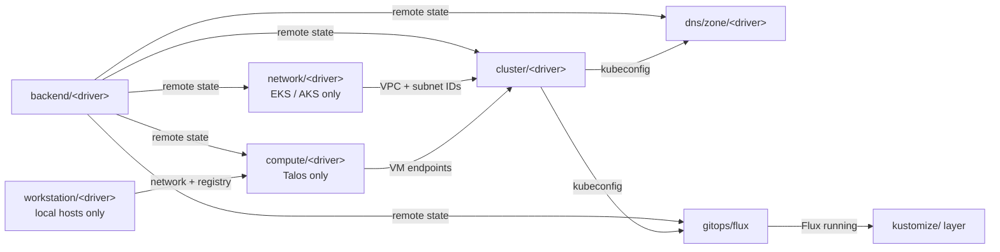

# terraform/

Each subdirectory here is a Terraform module that brings part of the
cloud or host substrate into existence: the state backend, the network
fabric, the Kubernetes control plane, the VM substrate (when Talos is
the cluster driver), and the GitOps bootstrap that hands reconciliation
off to Flux. Once Flux is up, the [`kustomize/`](../kustomize/) layer
takes over for everything that runs on the cluster.

## Bootstrap chain

The first `windsor bootstrap` runs `backend/<driver>` with local state
to provision the remote backend. Every later `windsor apply` reads /
writes through that backend.

## Modules

| Area | Drivers | Purpose |
|---|---|---|
| [backend](backend/) | [s3](backend/s3/) · [azurerm](backend/azurerm/) | Remote Terraform state + locking. |
| [workstation](workstation/) | [docker](workstation/docker/) · [incus](workstation/incus/) | Local-host runtime backing `windsor up` on developer machines. |
| [network](network/) | [aws-vpc](network/aws-vpc/) · [azure-vnet](network/azure-vnet/) | Cloud-side network fabric (VPC / VNet). EKS and AKS only; Talos clusters skip this layer. |
| [compute](compute/) | [docker](compute/docker/) · [hyperv](compute/hyperv/) · [incus](compute/incus/) | VM substrate Talos containers/VMs run on. Skipped on EKS / AKS. |
| [cluster](cluster/) | [aws-eks](cluster/aws-eks/) · [azure-aks](cluster/azure-aks/) · [talos](cluster/talos/) | Kubernetes control plane. |
| [dns/zone](dns/zone/) | [route53](dns/zone/route53/) · [azure-dns](dns/zone/azure-dns/) | Cloud-side DNS zone external-dns writes into. |
| [gitops](gitops/) | [flux](gitops/flux/) | Bootstraps Flux so the kustomize/ layer can self-manage. |
| [cni](cni/) | [cilium](cni/cilium/) | Out-of-band CNI bootstrap for Talos (pods need networking before Flux exists). |

## Conventions

Each module README has a brief hand-written intro followed by an
auto-generated `<!-- BEGIN_TF_DOCS -->` region (Requirements / Providers
/ Modules / Resources / Inputs / Outputs). The tables are materialized
by `terraform-docs` (`task docs:terraform`); CI fails the build on drift
(`task docs:terraform:check`).

For the underlying terraform style + naming conventions, see
[`.claude/skills/terraform-style/SKILL.md`](../.claude/skills/terraform-style/SKILL.md).

## Related

- [kustomize/](../kustomize/) — cluster add-ons reconciled by Flux after the bootstrap chain finishes.
- [contexts/_template/facets/](../contexts/_template/facets/) — facets that compose these modules into deployable bundles.
- Blueprint schema and facet syntax — https://www.windsorcli.dev/docs/blueprints/
