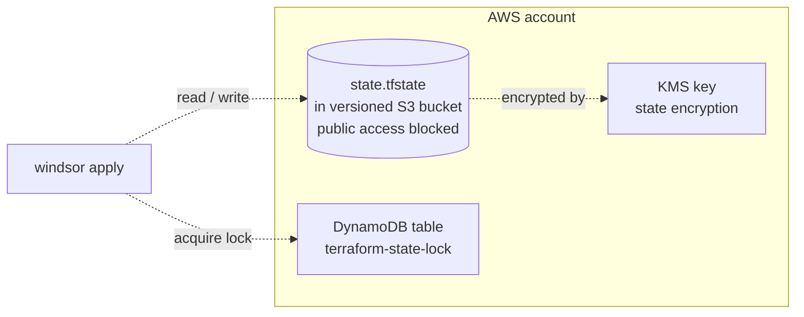
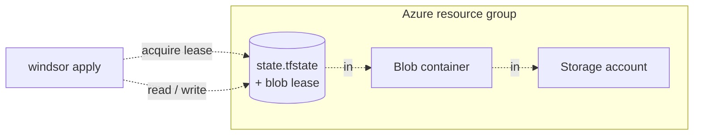

# Backend

The backend category has two drivers. `s3` provisions an AWS S3
bucket along with a DynamoDB table for state locking. `azurerm`
provisions an Azure Storage Account and a Blob container, using
Azure's native blob lease for locking. The driver is selected by
`terraform.backend.type`. The `local`, `kubernetes`, and `none`
backend types don't run a Terraform module; they're consumed directly
by Terraform without provisioning anything.

The backend stack runs first in every cloud context. The downstream
stacks (`network`, `cluster`, `dns-zone`) all depend on it.

The bootstrap pass runs each backend module with a local state file,
which provisions the bucket or Storage Account. Subsequent
`windsor apply` calls then read and write state through the remote
backend and hold the lock for the duration of the run.

## Recipes

### AWS / S3



```yaml
platform: aws
terraform:
  backend:
    type: s3
```

The module provisions an S3 bucket with versioning, server-side
encryption via a managed KMS key, lifecycle rules, and a public
access block. Locking goes through a DynamoDB table named for the
context. The bucket name and table name both derive from the context
`id` (top-level), which keeps state for different contexts in
distinct paths within the same account.

### Azure / AzureRM



```yaml
platform: azure
terraform:
  backend:
    type: azurerm
```

The module provisions a Storage Account and a Blob container. Locking
uses the native blob lease on the state object itself, so there's no
separate lock table to manage.

### Local (no backend module)

```yaml
# Any platform; common for dev contexts.
terraform:
  backend:
    type: local
```

No backend module runs. Terraform state lives next to each stack in
the context's local state directory. This is the right choice for
single-operator dev clusters and CI runs that don't need to share
state across machines.

## Operations

The bootstrap is a chicken-and-egg situation: the bucket has to exist
before Terraform can use it for state. The `s3` and `azurerm` modules
solve this by running with a local backend on the first apply, then
handing the state location over to the remote backend for subsequent
runs.

A state lock held by a dead run won't release on its own. A crashed
`windsor apply` leaves the lock in place. On AWS, delete the row from
the DynamoDB lock table; on Azure, release the lease on the state
blob. Audit the state first, because the lock exists for a reason.

Switching `terraform.backend.type` on a context that already has
remote state requires manual migration via
`terraform init -migrate-state`. Windsor doesn't auto-migrate.

`type: none` disables backend configuration entirely. Terraform then
writes state to the default in-memory location, which means no
persistence across runs. This is reserved for ephemeral test
contexts.

## Security

The `s3` module enables versioning, server-side KMS encryption, and a
public access block on the bucket. Versioning doubles as a poor-man's
audit trail for state writes.

The `azurerm` module uses blob leases for locking. The lease ID is
scoped to the Storage Account credential and isn't visible from
outside.

Neither module makes the state object public. Bucket policies on S3
and Storage Account network rules on Azure follow account defaults
and should be tightened to private subnets or service endpoints in
production.

## See also

- [s3/](s3/) and [azurerm/](azurerm/) for the per-driver Terraform reference.
- [Terraform backend docs](https://developer.hashicorp.com/terraform/language/backend) for the upstream backend reference.
- [../cluster/](../cluster/) and [../network/](../network/) for the downstream stacks that read state from the backend.
