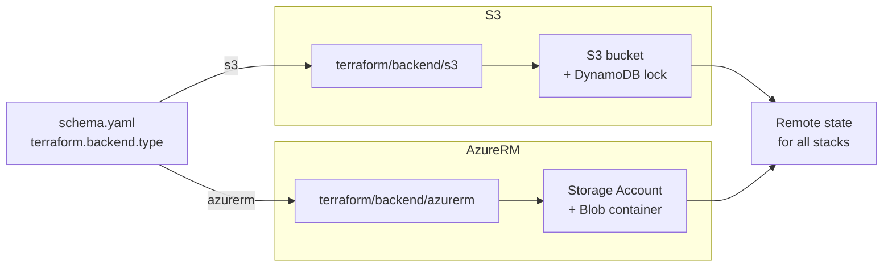

# Backend

Two drivers provision remote Terraform state infrastructure: `s3` (AWS S3
bucket + DynamoDB lock) and `azurerm` (Azure Storage Account + Blob with
native lease). Selection is by `terraform.backend.type`. The `local`,
`kubernetes`, and `none` backend types do not run a Terraform module —
they are consumed directly by Terraform without provisioning anything.

The backend stack runs first in every cloud context; downstream stacks
(`network`, `cluster`, `dns-zone`) all depend on it.

## Architecture



The bootstrap pass runs each backend module with a **local** state file,
provisioning the bucket / Storage Account. Subsequent `windsor apply`
calls then read and write state through the remote backend and hold the
lock for the duration of the run.

## Recipes

### AWS / S3

```yaml
platform: aws
terraform:
  backend:
    type: s3
```

Provisions an S3 bucket with versioning and server-side encryption, plus
a DynamoDB table for state locking. The bucket name and table name
derive from the context `id` (top-level), keeping state for different
contexts in distinct paths within the same account.

### Azure / AzureRM

```yaml
platform: azure
terraform:
  backend:
    type: azurerm
```

Provisions a Storage Account and Blob container. Locking uses Azure's
native blob lease so there is no separate lock table to manage.

### Local (no backend module)

```yaml
# Any platform; common for dev contexts.
terraform:
  backend:
    type: local
```

No backend module runs. Terraform state lives next to each stack in the
context's local state directory. Appropriate for single-operator dev
clusters and CI runs that don't need to share state across machines.

## Operations

- **Bootstrap chicken-and-egg** — the bucket has to exist before
  Terraform can use it for state. The s3 / azurerm modules solve this
  by running with a local backend on the first apply, then handing the
  state location over to the remote backend for subsequent runs.
- **State lock held by a dead run** — a crashed `windsor apply` leaves
  the lock in place. On AWS, delete the row from the DynamoDB lock
  table; on Azure, release the lease on the state blob. Audit the
  state first; the lock exists for a reason.
- **Backend type changed mid-context** — switching `terraform.backend.type`
  on a context that already has remote state requires manual migration
  (`terraform init -migrate-state`). Windsor does not auto-migrate.
- **`type: none` chosen accidentally** — disables backend configuration
  entirely. Terraform writes state to the default in-memory location,
  which means no persistence across runs. Reserved for ephemeral test
  contexts.

## Security

- The s3 module enables versioning and SSE on the bucket. Versioning
  also doubles as a poor-man's audit trail for state writes.
- The azurerm module uses blob leases for locking; the lease ID is
  scoped to the Storage Account credential and not visible from outside.
- Neither module makes the state object public. Bucket ACLs (S3) and
  Storage Account network rules (Azure) follow account defaults and
  should be tightened to private subnets / service endpoints in
  production.

## See also

- [s3/](s3/), [azurerm/](azurerm/) — per-driver Terraform reference.
- [Terraform backend docs](https://developer.hashicorp.com/terraform/language/backend) — upstream backend reference.
- [../cluster/](../cluster/), [../network/](../network/) — downstream stacks that read state from the backend.
