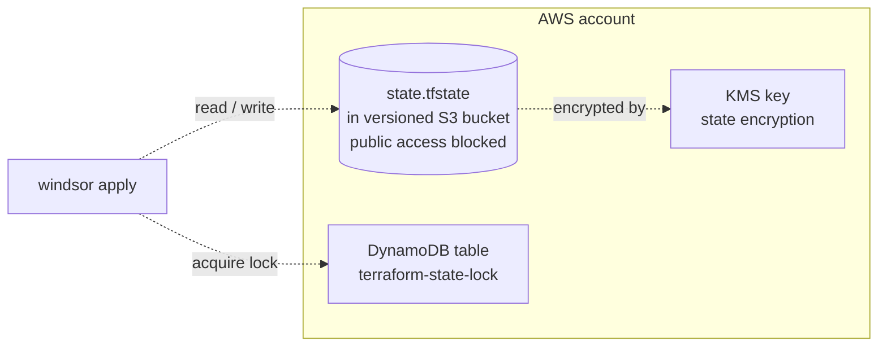

Remote Terraform state for AWS contexts. The bootstrap pass runs this
module with a local backend, provisioning an S3 bucket (with versioning
and server-side encryption) and a DynamoDB table for state locking.
Every subsequent `windsor apply` reads/writes through the bucket and
acquires the lock.

## Recipe



```yaml
platform: aws
terraform:
  backend:
    type: s3
```

The module provisions an S3 bucket with versioning, server-side
encryption via a managed KMS key, lifecycle rules, and a public
access block. Locking goes through a DynamoDB table named for the
context. The bucket name and table name both derive from the context
`id` (top-level), which keeps state for different contexts in
distinct paths within the same account.

## Operations

The bootstrap pass runs this module with a local backend first, then
hands the state location to the remote backend for subsequent
`windsor apply` runs.

A crashed `windsor apply` leaves the DynamoDB lock row in place.
Delete it before retrying — audit the state first, because the lock
exists for a reason.

Switching away from `s3` on a context that already has remote state
here requires manual migration via `terraform init -migrate-state`.
Windsor doesn't auto-migrate.

## Security

Versioning, server-side KMS encryption, and a public access block are
all enabled on the bucket. Versioning doubles as a poor-man's audit
trail for state writes. Bucket policies follow account defaults, so
tighten them to private subnets or service endpoints in production.

<!-- BEGIN_TF_DOCS -->
## Requirements

| Name | Version |
|------|---------|
| <a name="requirement_terraform"></a> [terraform](#requirement\_terraform) | >= 1.12.2 |
| <a name="requirement_aws"></a> [aws](#requirement\_aws) | 6.63.0 |

## Providers

| Name | Version |
|------|---------|
| <a name="provider_aws"></a> [aws](#provider\_aws) | 6.63.0 |
| <a name="provider_local"></a> [local](#provider\_local) | 2.8.0 |

## Modules

No modules.

## Resources

| Name | Type |
|------|------|
| [aws_kms_alias.terraform_state_alias](https://registry.terraform.io/providers/hashicorp/aws/6.63.0/docs/resources/kms_alias) | resource |
| [aws_kms_key.terraform_state](https://registry.terraform.io/providers/hashicorp/aws/6.63.0/docs/resources/kms_key) | resource |
| [aws_s3_bucket.this](https://registry.terraform.io/providers/hashicorp/aws/6.63.0/docs/resources/s3_bucket) | resource |
| [aws_s3_bucket_lifecycle_configuration.this](https://registry.terraform.io/providers/hashicorp/aws/6.63.0/docs/resources/s3_bucket_lifecycle_configuration) | resource |
| [aws_s3_bucket_logging.this](https://registry.terraform.io/providers/hashicorp/aws/6.63.0/docs/resources/s3_bucket_logging) | resource |
| [aws_s3_bucket_policy.this](https://registry.terraform.io/providers/hashicorp/aws/6.63.0/docs/resources/s3_bucket_policy) | resource |
| [aws_s3_bucket_public_access_block.this](https://registry.terraform.io/providers/hashicorp/aws/6.63.0/docs/resources/s3_bucket_public_access_block) | resource |
| [aws_s3_bucket_server_side_encryption_configuration.this](https://registry.terraform.io/providers/hashicorp/aws/6.63.0/docs/resources/s3_bucket_server_side_encryption_configuration) | resource |
| [aws_s3_bucket_versioning.this](https://registry.terraform.io/providers/hashicorp/aws/6.63.0/docs/resources/s3_bucket_versioning) | resource |
| [local_file.backend_config](https://registry.terraform.io/providers/hashicorp/local/latest/docs/resources/file) | resource |
| [aws_caller_identity.current](https://registry.terraform.io/providers/hashicorp/aws/6.63.0/docs/data-sources/caller_identity) | data source |
| [aws_region.current](https://registry.terraform.io/providers/hashicorp/aws/6.63.0/docs/data-sources/region) | data source |

## Inputs

| Name | Description | Type | Default | Required |
|------|-------------|------|---------|:--------:|
| <a name="input_context_id"></a> [context\_id](#input\_context\_id) | Context ID for the resources | `string` | `null` | no |
| <a name="input_context_path"></a> [context\_path](#input\_context\_path) | The path to the context folder | `string` | `""` | no |
| <a name="input_enable_kms"></a> [enable\_kms](#input\_enable\_kms) | Provision a customer-managed KMS key and use SSE-KMS for the state bucket. False uses SSE-S3 (AES-256). | `bool` | `true` | no |
| <a name="input_kms_key_alias"></a> [kms\_key\_alias](#input\_kms\_key\_alias) | The KMS key ID for encrypting the S3 bucket | `string` | `""` | no |
| <a name="input_kms_policy_override"></a> [kms\_policy\_override](#input\_kms\_policy\_override) | Override for the KMS policy document (for testing) | `string` | `null` | no |
| <a name="input_s3_bucket_name"></a> [s3\_bucket\_name](#input\_s3\_bucket\_name) | The name of the S3 bucket for storing Terraform state, overrides the default bucket name | `string` | `""` | no |
| <a name="input_s3_log_bucket_name"></a> [s3\_log\_bucket\_name](#input\_s3\_log\_bucket\_name) | Name of a pre-existing, centralized S3 logging bucket to receive access logs. Must be created outside this module. | `string` | `""` | no |
| <a name="input_tags"></a> [tags](#input\_tags) | Additional tags to apply to resources (default is empty). | `map(string)` | `{}` | no |
| <a name="input_terraform_state_iam_roles"></a> [terraform\_state\_iam\_roles](#input\_terraform\_state\_iam\_roles) | List of IAM role ARNs that should have access to the Terraform state bucket | `list(string)` | `[]` | no |

## Outputs

No outputs.
<!-- END_TF_DOCS -->