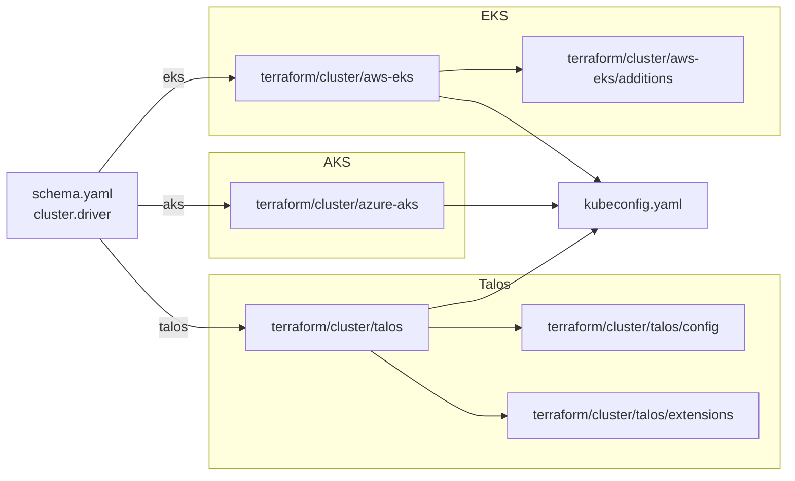

# Cluster

The cluster category has three drivers. `talos` provisions a self-hosted
control plane and is the default on bare metal and local providers.
`eks` provisions a managed AWS cluster, and `aks` provisions a managed
Azure cluster. The selector is `cluster.driver`, which defaults from
`platform` (aws picks eks, azure picks aks, anything else picks talos).
Setting `cluster.driver` explicitly overrides the platform default.

## Architecture



Every driver ends up writing a working kubeconfig. The kustomize layer
then adopts the cluster and brings up CNI, CSI, gateway, PKI, and DNS,
after which Flux drives reconciliation from the repo.

## Recipes

### Talos (self-hosted)

```yaml
platform: metal     # or hyperv, incus, docker
topology: single-node
cluster:
  driver: talos
  endpoint: https://10.5.0.1:6443
  controlplanes:
    count: 1
    schedulable: true
  workers:
    count: 0
  cni:
    driver: cilium    # default is flannel
```

The Talos API installs Kubernetes onto compute that's already up, so
the matching compute driver (`docker`, `hyperv`, or `incus`) needs to
provision nodes first. The `cluster/talos` module then reaches those
nodes through the Talos API and writes the kubeconfig. Setting
`cluster.cni.driver` to `cilium` runs the Cilium bootstrap module
before Flux starts.

### EKS (managed AWS)

```yaml
platform: aws
cluster:
  driver: eks
  pools:
    workers:
      class: general
      count: 2
      lifecycle: on-demand
```

EKS pulls networking from `terraform/network/aws-vpc` and provisions
managed node groups from `cluster.pools`. `cluster.workers` is ignored
on elastic providers, so use `pools` instead. The
`cluster/aws-eks/additions` module installs IAM entries that survive
across cluster destroys.

### AKS (managed Azure)

```yaml
platform: azure
cluster:
  driver: aks
  pools:
    workers:
      class: general
      count: 2
```

AKS pulls networking from `terraform/network/azure-vnet`. Cilium is
the in-box CNI here, so `cluster.cni` isn't exercised. When
`dns.public_domain` is set, Workload Identity gets wired for
cert-manager and external-dns.

## Operations

If `cluster.driver` and `platform` disagree (for example
`platform: metal` with `cluster.driver: eks`), Terraform binds to the
wrong cloud and fails at apply time. The schema validates the
documented coherent pairs, but novel combinations slip through and
only surface during the apply.

When Talos hangs at kubeconfig fetch, the endpoint isn't reachable.
`cluster.endpoint` has to match a real address, and the control plane
VM or container has to be up. Check the compute step's outputs first.

On elastic providers (EKS, AKS), `cluster.workers` is ignored. Define
`cluster.pools` instead.

`cluster.storage.driver` is Talos-only. Managed clusters use the
cloud's default CSI (EBS on EKS, Azure Disk on AKS) and ignore
whatever's set here.

Pinning a pool to a single instance type is fragile. Capacity
shortages will take the pool down. Provide a list of acceptable types
and let the provider pick.

## Security

Managed clusters use cloud-native identity for in-cluster integrations
(IRSA on EKS, Workload Identity on AKS). Service-account tokens don't
leave the cluster boundary in either case.

Talos enforces signed machine config, and rotation is handled inside
`cluster/talos/config`.

`cluster.controlplanes.schedulable: true` removes the NoSchedule taint
from the control plane. That's fine for single-node clusters but
worth reconsidering for anything multi-tenant.

## See also

- [talos/](talos/), [aws-eks/](aws-eks/), [azure-aks/](azure-aks/) for the per-driver Terraform reference.
- [../network/](../network/) for the VPC and VNet modules that back the cluster on AWS and Azure.
- [../compute/](../compute/) for Talos compute providers.
- [../cni/](../cni/) for the Cilium bootstrap module on Talos.
- [../../kustomize/cni/](../../kustomize/cni/), [../../kustomize/csi/](../../kustomize/csi/), and [../../kustomize/pki/](../../kustomize/pki/) for the kustomize add-ons that adopt the cluster.
