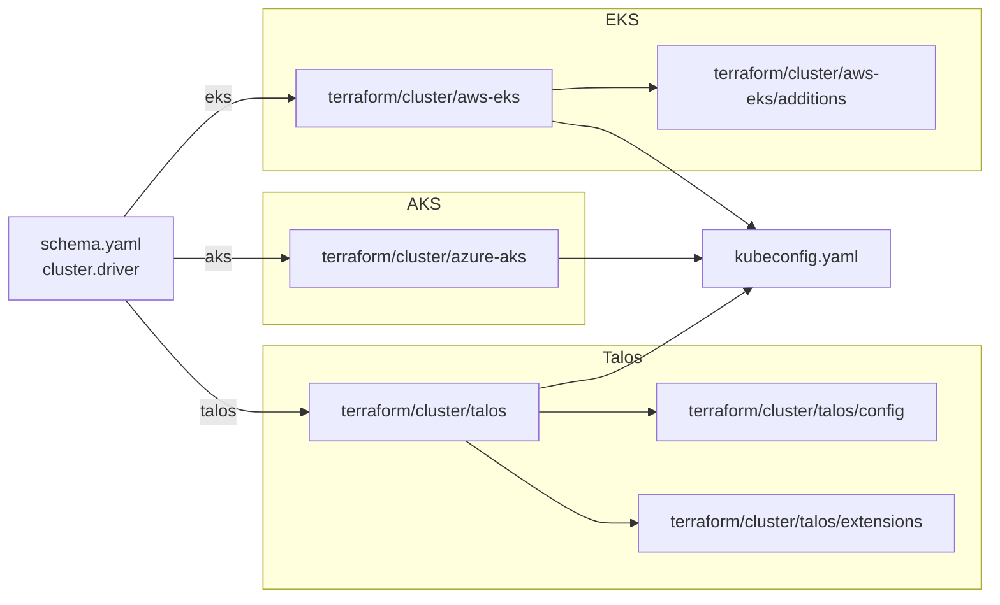

# Cluster

Three drivers create the Kubernetes control plane: `talos` (self-hosted,
default on bare metal and local providers), `eks` (managed AWS), and `aks`
(managed Azure). `cluster.driver` selects which one runs; it defaults from
`platform` (aws → eks, azure → aks, otherwise → talos) and an explicit
value wins.

## Architecture



Every driver produces a working kubeconfig. From there the `kustomize/`
layer adopts the cluster (CNI, CSI, gateway, PKI, DNS) and Flux takes over
reconciliation.

## Recipes

### Talos (self-hosted)

```yaml
platform: metal     # or hyperv, incus, docker
topology: single-node
cluster:
  driver: talos
  endpoint: https://10.5.0.1:6443
  controlplanes:
    count: 1
    schedulable: true
  workers:
    count: 0
  cni:
    driver: cilium    # default is flannel
```

The Talos API installs Kubernetes onto already-running compute. The matching
`compute/` driver (`docker`, `hyperv`, `incus`) must stand up nodes first;
`cluster/talos` then bootstraps the control plane and writes the
kubeconfig. Setting `cluster.cni.driver: cilium` runs the Cilium bootstrap
module before Flux starts.

### EKS (managed AWS)

```yaml
platform: aws
cluster:
  driver: eks
  pools:
    workers:
      class: general
      count: 2
      lifecycle: on-demand
```

EKS draws networking from `terraform/network/aws-vpc` and provisions managed
node groups from `cluster.pools`. `cluster.workers` is ignored on elastic
providers. The `cluster/aws-eks/additions` module installs IAM entries that
persist across cluster destroys.

### AKS (managed Azure)

```yaml
platform: azure
cluster:
  driver: aks
  pools:
    workers:
      class: general
      count: 2
```

AKS draws networking from `terraform/network/azure-vnet`. Cilium ships as
the in-box CNI so `cluster.cni` is not exercised. Workload Identity is
wired for cert-manager and external-dns when `dns.public_domain` is set.

## Operations

- **`cluster.driver` and `platform` disagree** — `platform: metal` with
  `cluster.driver: eks` (or any mismatched pair) silently binds the wrong
  cloud and fails at apply. Schema validation catches the documented pairs;
  novel pairs surface at `terraform apply` time.
- **Kubeconfig fetch hangs on Talos** — `cluster.endpoint` must match a
  reachable address and the control plane VM/container must be up. Check
  `compute/` outputs first.
- **EKS or AKS workers don't appear** — `cluster.workers` is ignored on
  elastic providers. Define `cluster.pools` instead.
- **`cluster.storage.driver` set on a managed cluster** — the field is
  Talos-only. Managed clusters use the cloud's default CSI (EBS on EKS,
  Azure Disk on AKS).
- **Pool pinned to a single instance type** — capacity shortages take the
  pool down. Provide multiple types in `instance_types` and let the
  provider pick.

## Security

- Managed clusters use cloud-native identity for in-cluster integrations:
  IRSA on EKS, Workload Identity on AKS. Service-account tokens never
  leave the cluster boundary.
- Talos enforces signed machine config; rotation is handled inside
  `cluster/talos/config`.
- `cluster.controlplanes.schedulable: true` lifts the NoSchedule taint
  from the control plane. Acceptable for single-node clusters; reconsider
  for multi-tenant production.

## See also

- [talos/](talos/), [aws-eks/](aws-eks/), [azure-aks/](azure-aks/) — per-driver Terraform reference.
- [../network/](../network/) — VPC/VNet that backs the cluster on AWS/Azure.
- [../compute/](../compute/) — Talos compute providers.
- [../cni/](../cni/) — Cilium bootstrap module (Talos).
- [../../kustomize/cni/](../../kustomize/cni/), [../../kustomize/csi/](../../kustomize/csi/), [../../kustomize/pki/](../../kustomize/pki/) — kustomize add-ons that adopt the cluster.
