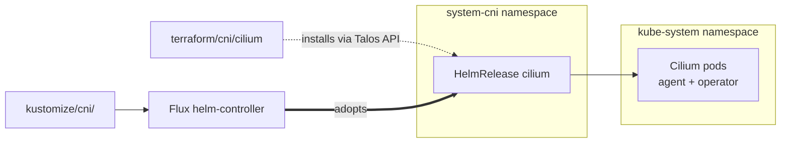

# CNI

The cni category has one driver, `cilium`, which only runs when
`cluster.driver: talos` and `cluster.cni.driver: cilium`. Managed
clusters bring their own CNI (VPC CNI on EKS, in-box Cilium on AKS),
so this category doesn't run for them. Talos with the default
`flannel` driver also skips it.

The module exists because Talos starts with `kubeProxyReplacement:
true` and no built-in CNI when Cilium is chosen, and Flux can't
reconcile until Pods can network. So this module installs Cilium
directly via Helm against the Talos API, and `kustomize/cni/` then
adopts the running release so day-2 changes flow through GitOps.

## Recipe



```yaml
platform: metal     # or hyperv, incus, docker
cluster:
  driver: talos
  cni:
    driver: cilium
```

There's no `cilium` block at the schema level; the only knob is the
driver selector. The tunables (operator replica count, Hubble
settings, LBIPAM ranges) flow through the `kustomize/cni/`
substitutions rather than through this module.

The bootstrap-then-adopt handoff is the architectural point.
Terraform installs Cilium via the Talos API before Flux can run.
After Flux comes up, it adopts the HelmRelease that already exists
and takes ownership of subsequent upgrades.

## Operations

If the module runs but Cilium pods crash on Talos, the `cilium/talos`
kustomize component (the capabilities patch) hasn't been applied yet.
The terraform module only installs the base release; Talos-specific
patches live in `kustomize/cni/cilium/talos/`.

If `windsor apply` flaps Cilium replica counts, the
Terraform-installed release and the Flux-adopted HelmRelease are
computing `operator_replicas` from different sources. Both have to
derive from `topology`.

Leaving `cluster.cni.driver` unset (or `flannel`) skips this module
entirely. Flannel is the Talos built-in and needs no bootstrap.

## See also

- [cilium/](cilium/) for the per-module Terraform reference.
- [../../kustomize/cni/](../../kustomize/cni/) for the adopting HelmRelease and the full operational guide for Cilium (substitutions, components, dependencies).
- [../cluster/](../cluster/) for the cluster module that produces the kubeconfig this bootstrap uses.
