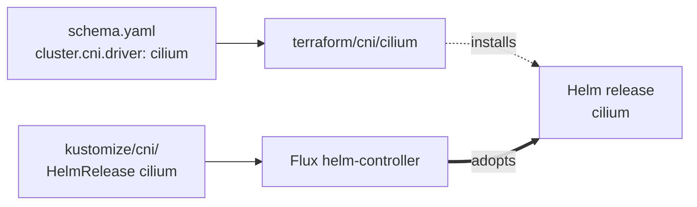

# CNI

One driver: `cilium`. Runs only when `cluster.driver: talos` and
`cluster.cni.driver: cilium`. Managed clusters bring their own CNI
(VPC CNI on EKS, in-box Cilium on AKS), so this category does not run
for them. Talos with the default `flannel` driver also skips it.

The module exists because Talos starts with `kubeProxyReplacement: true`
and no built-in CNI when Cilium is chosen — Flux can't reconcile until
Pods can network. This module installs Cilium directly via Helm against
the Talos API, then `kustomize/cni/` adopts the running release so day-2
changes flow through GitOps.

## Architecture



After bootstrap, the HelmRelease in `kustomize/cni/` matches the
running Helm release and Flux takes over reconciliation. Values
upgrades from then on flow through GitOps.

## Recipe

```yaml
platform: metal     # or hyperv, incus, docker
cluster:
  driver: talos
  cni:
    driver: cilium
```

No `cilium` block exists at the schema level; the only knob is the
driver selector. Tunables (operator replica count, Hubble settings,
LBIPAM ranges) flow through the `kustomize/cni/` substitutions, not
through this module.

## Operations

- **Module runs but Cilium pods crash on Talos** — the `cilium/talos`
  kustomize component (capabilities patch) hasn't been applied. The
  terraform module only installs the base release; Talos-specific
  patches live in `kustomize/cni/cilium/talos/`.
- **`windsor apply` flaps Cilium replica counts** — the Terraform-
  installed release and the Flux-adopted HelmRelease compute
  `operator_replicas` from different sources. Both must derive from
  `topology`.
- **Skipping cilium on Talos** — leaving `cluster.cni.driver` unset (or
  `flannel`) bypasses this module entirely. Flannel is the Talos
  built-in and needs no bootstrap.

## See also

- [cilium/](cilium/) — per-module Terraform reference.
- [../../kustomize/cni/](../../kustomize/cni/) — the adopting HelmRelease and full operational guide for Cilium (substitutions, components, dependencies).
- [../cluster/](../cluster/) — the cluster module that produces the kubeconfig this bootstrap uses.
