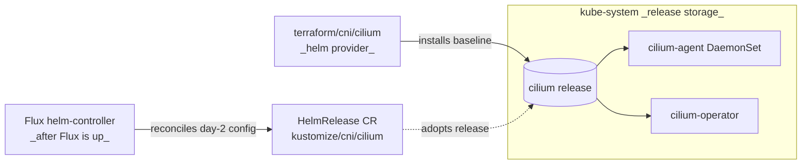

# cni/cilium

Installs Cilium so pod networking is available when Flux starts.
On Talos there's a chicken-and-egg: Flux needs pod networking to
reconcile anything, but Flux is normally what installs the CNI. This
module breaks the cycle by installing Cilium directly via the `helm`
provider. The Flux-managed HelmRelease in
[kustomize/cni/cilium](../../../kustomize/cni/cilium/) adopts the
release on its first reconcile and owns day-2 features (Hubble,
Gateway API, Prometheus, L2 announcer) from then on.

## Flow

## Wiring

Auto-wired on Talos by
[option-cni.yaml](../../../contexts/_template/facets/option-cni.yaml).
The facet supplies:

- `cluster_endpoint` — `cluster.endpoint` if set, else the `cluster` module's bootstrap output.
- `operator_replicas` — derived from the top-level `topology` field: `single-node` → 1, otherwise → 2.
- `privileged: false` and `cgroup_auto_mount: false` — both required on Talos.

Inputs not listed (`cilium_version`, `ipam_mode`,
`kube_proxy_replacement`) keep their module defaults. See
[Inputs](#inputs) for the full interface.

## Security

Runs in `kube-system`. With `privileged: false` (the value the facet
sets on Talos), the agent runs with a minimal upstream-recommended
Linux capability set; see [main.tf](main.tf) for the exact list.

## See also

- [kustomize/cni/](../../../kustomize/cni/) — Flux-managed HelmRelease that adopts this release for day-2 reconciliation.
- [option-cni.yaml](../../../contexts/_template/facets/option-cni.yaml) — facet wiring.
- Cilium documentation — https://docs.cilium.io/

## Reference

The full module interface — every input, output, and resource — is
listed below. Override any input from your context by adding a tfvars
file at `contexts/<context>/terraform/cni.tfvars`.

<!-- BEGIN_TF_DOCS -->
### Requirements

| Name | Version |
|------|---------|
|  [terraform](#requirement\_terraform) | >=1.8 |
|  [helm](#requirement\_helm) | 3.1.1 |

### Providers

| Name | Version |
|------|---------|
|  [helm](#provider\_helm) | 3.1.1 |

### Modules

No modules.

### Resources

| Name | Type |
|------|------|
| [helm_release.cilium](https://registry.terraform.io/providers/hashicorp/helm/3.1.1/docs/resources/release) | resource |

### Inputs

| Name | Description | Type | Default | Required |
|------|-------------|------|---------|:--------:|
|  [cgroup\_auto\_mount](#input\_cgroup\_auto\_mount) | Let Cilium mount the cgroup2 fs at startup (chart default). Set to false on systems that mount cgroups during init (Talos, most systemd-based distros on recent kernels) so Cilium uses the pre-mounted path instead of racing to mount its own. | `bool` | `true` | no |
|  [cilium\_version](#input\_cilium\_version) | Version of the Cilium Helm chart to install. | `string` | `"1.19.3"` | no |
|  [cluster\_endpoint](#input\_cluster\_endpoint) | Kubernetes API server endpoint (https://host:port). Required when kube\_proxy\_replacement is true so Cilium can reach the API server before eBPF service rules are active. | `string` | `""` | no |
|  [ipam\_mode](#input\_ipam\_mode) | Cilium IPAM mode. 'kubernetes' uses node CIDR ranges (default, works for Talos and standard EKS). 'eni' uses AWS ENI-based allocation for EKS native networking. | `string` | `"kubernetes"` | no |
|  [kube\_proxy\_replacement](#input\_kube\_proxy\_replacement) | Replace kube-proxy with Cilium's eBPF implementation. Requires cluster\_endpoint to be set. Recommended for Talos and EKS. | `bool` | `true` | no |
|  [operator\_replicas](#input\_operator\_replicas) | Cilium operator replica count. Keep aligned with the Flux-managed HelmRelease so re-runs of this bootstrap don't scale the deployment up or down between Flux reconciles. 1 on physically single-node clusters (operator binds a hostPort, so two replicas can't co-schedule); 2 elsewhere for controller redundancy. | `number` | `2` | no |
|  [privileged](#input\_privileged) | Run the Cilium agent as a privileged container (chart default). Set to false on systems that forbid privileged pods (Talos, hardened distros); the agent will run with an explicit set of Linux capabilities instead. | `bool` | `true` | no |

### Outputs

No outputs.
<!-- END_TF_DOCS -->
