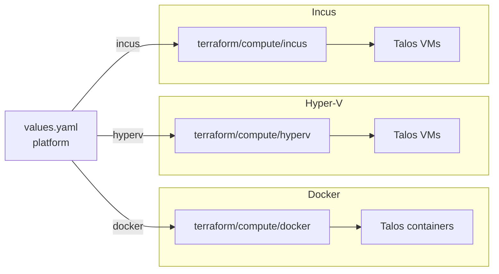

# Compute

The compute category has three drivers that provision Talos nodes on
local hardware. `docker` runs nodes as containers and is the default
on macOS and Linux dev machines. `hyperv` runs them as VMs on a
Windows host. `incus` runs them as VMs on Linux. The driver is
selected by `platform`. Managed-cloud platforms (`aws`, `azure`) and
bare-metal (`metal`) don't use a compute module: EKS and AKS
provision their own nodes, and `metal` expects nodes that already
exist.

Compute always runs before the `cluster/talos` module, which then
reaches the provisioned nodes through the Talos API.

## Architecture



Node sizing (count, CPU, memory, disks) comes from
`cluster.controlplanes` and `cluster.workers` and is the same across
all three drivers.

## Recipes

### Docker (macOS or Linux dev)

```yaml
platform: docker
workstation:
  runtime: docker-desktop    # or colima, docker
cluster:
  driver: talos
  controlplanes:
    count: 1
    schedulable: true
  workers:
    count: 0
topology: single-node
```

The module provisions Talos containers against the local Docker
socket. `workstation.runtime: docker-desktop` is the macOS path and
forces flannel CNI, because Cilium has no working transport over the
desktop loopback. `colima` is the lighter macOS alternative, and
plain `docker` is the Linux engine path.

### Hyper-V (Windows host)

```yaml
platform: hyperv
cluster:
  driver: talos
  endpoint: https://192.168.3.77:6443
  controlplanes:
    count: 1
    cpu: 4
    memory: 8
  workers:
    count: 1
    root_disk_size: 30
```

The module provisions Talos VMs on a Windows host running Hyper-V
(Pro, Enterprise, or Server). It reaches the host over SSH using the
credentials in the context's `environment:` block. `cluster.endpoint`
is the bench address that hairpins through the Hyper-V NAT back to
the control plane.

### Incus (Linux host)

```yaml
platform: incus
workstation:
  arch: amd64
cluster:
  driver: talos
  controlplanes:
    count: 1
  workers:
    count: 1
```

The module provisions Talos VMs on a local Incus daemon (KVM-backed).
This is the right choice when you need real VM isolation, nested KVM,
or kernel features that Docker on macOS can't expose.
`workstation.arch` selects the Talos image architecture.

## Operations

When `cluster/talos` hangs waiting for nodes, compute either didn't
run or its outputs aren't visible to the cluster step. The cluster
fans out from `terraform_output("compute", ...)`, so check the
terraform plan for the compute step first.

Docker Desktop ignores `cluster.cni.driver: cilium`. Cilium has no
transport over the desktop loopback, so the workstation facet forces
flannel regardless. Use Colima or Incus if Cilium is required
locally.

When the Hyper-V provider can't reach the host, the usual cause is
that the SSH host key isn't in the operator's `~/.ssh/known_hosts`.
The provider refuses unknown hosts, and the failure surfaces during
`terraform plan`.

If you intend to use Longhorn, the default `root_disk_size` is too
small. Longhorn needs a dedicated disk via `cluster.workers.disks`;
the root disk is for the OS only.

A single-node cluster with `controlplanes.count: 1` and
`workers.count: 0` only schedules pods when
`controlplanes.schedulable: true`. The `topology: single-node` preset
sets this automatically.

## Security

The Docker driver uses the host Docker socket and runs Talos
containers privileged. That's root-equivalent on the host and isn't
intended for shared developer machines.

The Hyper-V driver needs Administrator credentials to the Windows
host. The credentials live in the context's `environment:` block and
should come from a secrets manager via `windsor exec`, not from a
plaintext file.

Incus VMs run as full KVM instances with host-isolated kernels. Talos
machine secrets are generated per cluster and never leave the
operator's workstation in cleartext.

## See also

- [docker/](docker/), [hyperv/](hyperv/), and [incus/](incus/) for the per-driver Terraform reference.
- [../cluster/](../cluster/) for the Talos control plane that adopts the compute nodes.
- [../workstation/](../workstation/) for the host-side networking (registry, DNS) that local clusters depend on.
- [../network/](../network/) for the cloud networking modules, which are skipped on local compute.
