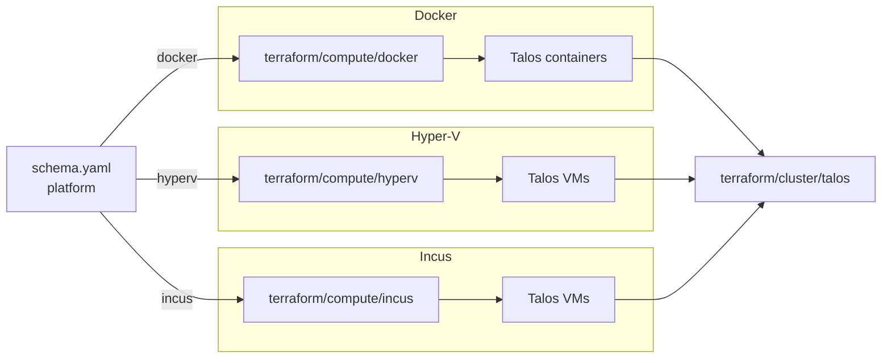

# Compute

Three drivers provision Talos nodes on local hardware: `docker` (containers,
default on macOS and Linux dev machines), `hyperv` (Windows VMs), and `incus`
(Linux VMs). Selection is by `platform`. Managed-cloud platforms (`aws`,
`azure`) and `metal` do not use a compute module — EKS/AKS provision their
own nodes, and `metal` expects nodes that already exist.

Compute always runs before the `cluster/talos` module, which then reaches the
provisioned nodes through the Talos API.

## Architecture



Node sizing (count, CPU, memory, disks) comes from `cluster.controlplanes`
and `cluster.workers` and is shared across all three drivers.

## Recipes

### Docker (macOS / Linux dev)

```yaml
platform: docker
workstation:
  runtime: docker-desktop    # or colima, docker
cluster:
  driver: talos
  controlplanes:
    count: 1
    schedulable: true
  workers:
    count: 0
topology: single-node
```

Provisions Talos containers against the local Docker socket.
`workstation.runtime: docker-desktop` is the macOS path and forces flannel
CNI (Cilium has no working transport over the desktop loopback). `colima` is
the lighter macOS alternative; plain `docker` is the Linux engine path.

### Hyper-V (Windows host)

```yaml
platform: hyperv
cluster:
  driver: talos
  endpoint: https://192.168.3.77:6443
  controlplanes:
    count: 1
    cpu: 4
    memory: 8
  workers:
    count: 1
    root_disk_size: 30
```

Provisions Talos VMs on a Windows host running Hyper-V (Pro, Enterprise, or
Server). The host is reached over SSH using the credentials in the context's
`environment:` block. `cluster.endpoint` is the bench address that hairpins
through Hyper-V NAT back to the control plane.

### Incus (Linux host)

```yaml
platform: incus
workstation:
  arch: amd64
cluster:
  driver: talos
  controlplanes:
    count: 1
  workers:
    count: 1
```

Provisions Talos VMs on a local Incus daemon (KVM-backed). Useful when you
need real VM isolation, nested KVM, or kernel features that Docker-on-Mac
can't expose. `workstation.arch` selects the Talos image architecture.

## Operations

- **`cluster/talos` hangs waiting for nodes** — compute didn't run or its
  outputs aren't visible. Check the terraform plan for the compute step
  first; cluster fans out from `terraform_output("compute", ...)`.
- **Docker Desktop ignores `cluster.cni.driver: cilium`** — Cilium has no
  transport over the desktop loopback, so the workstation facet forces
  flannel regardless. Use Colima or Incus if Cilium is required locally.
- **Hyper-V provider can't reach the host** — the SSH host key must already
  be in the operator's `~/.ssh/known_hosts`. The provider refuses unknown
  hosts and the error surfaces during `terraform plan`.
- **Disk sizing too small for Longhorn** — `cluster.workers.root_disk_size`
  defaults to the provider minimum. Block storage needs a dedicated disk
  via `cluster.workers.disks`; the root disk is for the OS only.
- **Single-node cluster pods stay Pending** — `cluster.controlplanes.count:
  1` with `cluster.workers.count: 0` only schedules when
  `controlplanes.schedulable: true`. The single-node topology preset sets
  this automatically.

## Security

- The Docker driver uses the host Docker socket and runs Talos containers
  privileged. This is root-equivalent on the host; not intended for shared
  developer machines.
- The Hyper-V driver requires Administrator credentials to the Windows
  host. Credentials live in the context's `environment:` block and should
  be sourced from a secrets manager via `windsor exec`.
- Incus VMs run as full KVM instances with host-isolated kernels. Talos
  machine secrets are generated per cluster and never leave the operator's
  workstation in plain text.

## See also

- [docker/](docker/), [hyperv/](hyperv/), [incus/](incus/) — per-driver Terraform reference.
- [../cluster/](../cluster/) — Talos control plane that adopts the compute nodes.
- [../workstation/](../workstation/) — host-side networking (registry, DNS) for local clusters.
- [../network/](../network/) — cloud networking (skipped on local compute).
