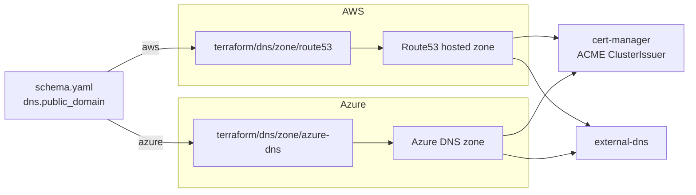

# DNS

Two drivers under `dns/zone/` provision public DNS zones: `route53` (AWS)
and `azure-dns` (Azure). Selection follows `platform`, and the zone
module only runs when `dns.public_domain` is set. With no public domain,
the cluster falls back to self-signed certificates and no external zone
is created.

Zones are provisioned in their own Terraform stack so they have an
independent lifecycle — tearing down the cluster does not drag the zone
(and its NS delegation effort) with it.

## Architecture



The cluster module wires identity into both consumers: IAM Role + Pod
Identity (EKS), Workload Identity (AKS). cert-manager solves DNS-01
ACME challenges to issue real Let's Encrypt certificates; external-dns
keeps record sets in sync with Ingress and HTTPRoute objects.

## Recipes

### AWS Route53

```yaml
platform: aws
dns:
  public_domain: example.windsorcli.dev
```

Provisions a Route53 public hosted zone in the active account. The
cluster module then provisions a scoped IAM role for cert-manager
(record-write actions limited to this zone's ID via
`cert_manager_hosted_zone_ids`) and the Pod Identity association.

Post-apply: delegate the parent domain at your registrar to the four
name servers in the module output (`name_servers`). Until delegation
propagates, ACME challenges will fail and external-dns will warn but
not block.

### Azure DNS

```yaml
platform: azure
dns:
  public_domain: example.windsorcli.dev
```

Provisions an Azure DNS public zone in the resource group. Workload
Identity is configured on the AKS cluster for cert-manager and
external-dns to write records into this zone.

### Self-signed (no public domain)

```yaml
platform: aws    # or any platform
# dns.public_domain unset
```

No DNS zone module runs. The cluster uses a self-signed ClusterIssuer
for gateway TLS — the "just-works" mode for dev clusters and local
deployments. Browsers will warn on the cert but everything else works.

## Operations

- **ACME challenges fail with NXDOMAIN** — NS delegation at the
  registrar hasn't propagated. Check `dig NS example.windsorcli.dev`
  against the public root resolvers; until it returns the zone's name
  servers, cert-manager can't write the DNS-01 record where ACME
  expects to read it.
- **external-dns logs `AccessDenied` (AWS)** — the cluster's
  cert-manager IAM role is scoped to one zone ID. If the zone was
  re-created out-of-band (different ID), the role's resource ARN no
  longer matches. Re-apply the cluster module to refresh the binding.
- **Zone destroyed but records remain** — Route53 zones with active
  records refuse to delete. `terraform destroy` on the dns-zone stack
  will fail until external-dns has cleaned up record sets. Drain the
  cluster first, then destroy the zone.
- **`dns.private_domain` set without a zone module** — `private_domain`
  is consumed by the network module's VPC-scoped private Route53 zone
  (AWS) and by in-cluster CoreDNS; no separate `dns/zone/private/*`
  module exists.

## Security

- IAM (EKS) and Workload Identity (AKS) bindings scope write access to
  the single zone provisioned by this module. Compromised cert-manager
  or external-dns cannot write into unrelated zones in the same
  account.
- The zone module exports name servers but no credentials. Delegation
  is an out-of-band operation done by the operator at their registrar.
- Self-signed mode generates a root CA inside the cluster; trust it
  manually on developer machines rather than disabling TLS verification.

## See also

- [zone/route53/](zone/route53/), [zone/azure-dns/](zone/azure-dns/) — per-driver Terraform reference.
- [../cluster/](../cluster/) — provisions the identity binding (IAM Pod Identity, Workload Identity).
- [../../kustomize/pki/](../../kustomize/pki/) — cert-manager and ClusterIssuers.
- [../../kustomize/dns/](../../kustomize/dns/) — external-dns reconciler.
