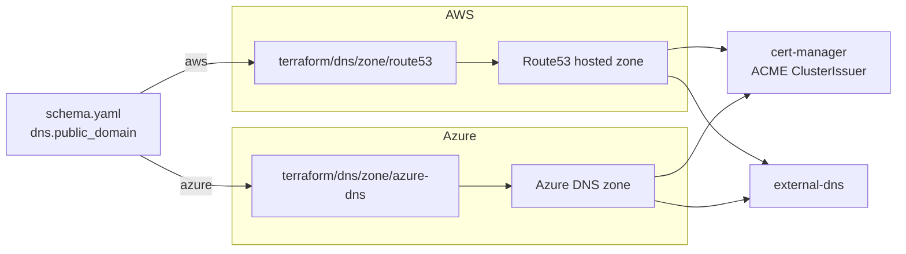

# DNS

The dns category has two drivers under `dns/zone/`. `route53`
provisions a public Route53 hosted zone on AWS, and `azure-dns`
provisions a public DNS zone on Azure. The driver is selected by
`platform`, and the zone module only runs when `dns.public_domain` is
set. With no public domain, the cluster falls back to self-signed
certificates and no external zone is created.

Zones are provisioned in their own Terraform stack so they have an
independent lifecycle. Tearing down the cluster doesn't drag the zone
(and its NS delegation effort) along with it.

## Architecture



The cluster module wires identity into both consumers: an IAM Role
plus Pod Identity on EKS, Workload Identity on AKS. cert-manager
solves DNS-01 ACME challenges to issue real Let's Encrypt
certificates. external-dns keeps record sets in sync with Ingress and
HTTPRoute objects.

## Recipes

### AWS Route53

```yaml
platform: aws
dns:
  public_domain: example.windsorcli.dev
```

The module provisions a Route53 public hosted zone in the active
account. The cluster module then provisions a scoped IAM role for
cert-manager (the role's record-write actions are limited to this
zone's ID via `cert_manager_hosted_zone_ids`) and the Pod Identity
association.

After the apply, delegate the parent domain at your registrar to the
four name servers in the module output (`name_servers`). Until
delegation propagates, ACME challenges fail and external-dns warns
but doesn't block.

### Azure DNS

```yaml
platform: azure
dns:
  public_domain: example.windsorcli.dev
```

The module provisions an Azure DNS public zone in the resource group.
Workload Identity is configured on the AKS cluster for cert-manager
and external-dns to write records into this zone.

### Self-signed (no public domain)

```yaml
platform: aws    # or any platform
# dns.public_domain unset
```

No DNS zone module runs. The cluster uses a self-signed ClusterIssuer
for gateway TLS, which is the just-works mode for dev clusters and
local deployments. Browsers will warn on the cert, but everything
else works.

## Operations

ACME challenges that fail with NXDOMAIN almost always mean NS
delegation at the registrar hasn't propagated yet. Run
`dig NS example.windsorcli.dev` against the public root resolvers;
until that returns the zone's name servers, cert-manager can't write
the DNS-01 record where ACME expects to read it.

When external-dns logs `AccessDenied` on AWS, the cluster's
cert-manager IAM role is scoped to a single zone ID. If the zone was
re-created out-of-band (different ID), the role's resource ARN no
longer matches. Re-apply the cluster module to refresh the binding.

Destroying a Route53 zone with active records fails, because Route53
refuses to delete a zone that still contains record sets.
`terraform destroy` on the dns-zone stack won't succeed until
external-dns has cleaned up. Drain the cluster first, then destroy
the zone.

`dns.private_domain` doesn't trigger a separate zone module. It's
consumed by the network module's VPC-scoped private Route53 zone on
AWS, and by in-cluster CoreDNS. There's no `dns/zone/private/*`
module.

## Security

The IAM role on EKS and the Workload Identity binding on AKS are both
scoped to the single zone provisioned by this module. A compromised
cert-manager or external-dns can't write into unrelated zones in the
same account.

The zone module exports name servers but no credentials. Delegation
is an out-of-band operation the operator does at their registrar.

Self-signed mode generates a root CA inside the cluster. Trust that
CA manually on developer machines rather than disabling TLS
verification.

## See also

- [zone/route53/](zone/route53/) and [zone/azure-dns/](zone/azure-dns/) for the per-driver Terraform reference.
- [../cluster/](../cluster/) for the cluster module that provisions the identity binding (IAM Pod Identity, Workload Identity).
- [../../kustomize/pki/](../../kustomize/pki/) for cert-manager and the ClusterIssuers.
- [../../kustomize/dns/](../../kustomize/dns/) for the external-dns reconciler.
