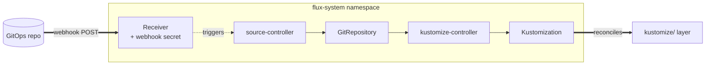
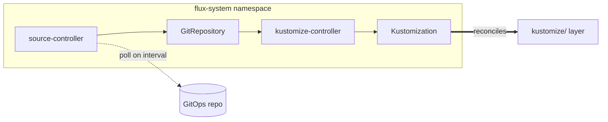

# GitOps

The gitops category has one module, `flux`, which runs after the cluster
module on every platform. It installs the Flux CRDs and controllers and
then creates a root `GitRepository` plus root `Kustomization` pointing at
the context's GitOps repo. Once those exist, Flux watches the repo and
reconciles whatever's under `kustomize/`. The terraform module itself
doesn't have much to do on subsequent applies.

`gitops.mode` controls how Flux learns about new commits. The default
is `push`, which creates a Flux Receiver so a webhook POST from the repo
triggers reconciliation immediately. `pull` mode skips the Receiver and
relies on the interval poll on the GitRepository.

## Recipes

### Push mode (default)



```yaml
gitops:
  mode: push
  repository:
    name: local
  webhook:
    token: ${env.FLUX_WEBHOOK_TOKEN}    # set in production
```

A Flux Receiver Secret is created with the value of `webhook.token`.
The repo's webhook configuration posts to the Receiver URL on every
push, and notification-controller signals source-controller to
reconcile immediately. The intervals on the GitRepository still
apply, but they're acting as a safety-net poll rather than the
primary trigger.

### Pull mode



```yaml
gitops:
  mode: pull
  repository:
    name: local
```

No Receiver is created. source-controller polls the GitRepository at
its configured interval and reconciles when the commit hash changes.
Use this when webhooks aren't an option, for example on private
clusters with no inbound HTTP, or on source-of-truth repos that don't
support webhooks.

## Operations

If push-mode reconciliation doesn't fire on a push, the Receiver
Secret token has to match the token the repo's webhook is signing
with. Check both sides. The workstation default value is a placeholder
and should be rotated if it ever leaked into production.

Flux controllers stuck in CrashLoopBackOff after install almost always
mean pod networking isn't up. On Talos + Cilium, the `cni/cilium`
bootstrap step has to complete before this module runs, which the
stack ordering in the `platform-*` facets enforces.

A root Kustomization stuck in NotReady usually means the GitOps repo
doesn't contain the path the module configured, or the URL or branch
is wrong. `flux get sources git` shows the active GitRepository state,
and `flux get kustomizations` shows the reconciliation status.

The webhook token in workstation mode is a known placeholder.
Production clusters need to set `gitops.webhook.token` explicitly and
pull the value from a secret store rather than checking it into the
values file.

## See also

- [flux/](flux/) for the per-module Terraform reference.
- [../cluster/](../cluster/) for the cluster module that produces the kubeconfig used here.
- [../../kustomize/](../../kustomize/) for the layer Flux reconciles once the install completes.
