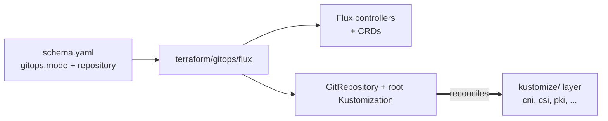

# GitOps

One driver: `flux`. Runs after `cluster` on every platform. Installs
Flux's CRDs and controllers, then stamps a root `GitRepository` and
`Kustomization` that point at the context's GitOps repo. From that
point on, Flux self-manages and the kustomize/ layer drives every
day-2 change.

`gitops.mode` picks how Flux learns about repo changes: `push` (the
default) wires a Flux Receiver so webhook POSTs trigger immediate
reconciliation; `pull` falls back to interval polling without a
Receiver.

## Architecture



After bootstrap, this module is mostly inert. Flux watches the
GitRepository (or the Receiver in push mode), notices new commits, and
reconciles the kustomize/ layer. Subsequent `windsor apply` runs that
don't change anything in this module just confirm Flux is still healthy.

## Recipes

### Push mode (default)

```yaml
gitops:
  mode: push
  repository:
    name: local
  webhook:
    token: ${env.FLUX_WEBHOOK_TOKEN}    # set in production
```

A Flux Receiver Secret is created with `webhook.token`. The repo's
webhook configuration posts to the Receiver URL on push, and Flux
reconciles immediately. Intervals on the GitRepository act as a
safety-net poll only.

### Pull mode

```yaml
gitops:
  mode: pull
  repository:
    name: local
```

No Receiver is created. Flux polls the GitRepository at its configured
interval. Use this when webhooks aren't an option (private clusters
without inbound HTTP, source-of-truth repos with no webhook support).

## Operations

- **Push-mode reconciliation doesn't fire on push** — the Receiver
  Secret token must match the token the repo's webhook is signing
  with. Verify both sides; rotate `gitops.webhook.token` if the
  workstation default leaked into production.
- **Flux controllers stuck CrashLoopBackOff after install** — usually
  pod networking isn't up. On Talos+Cilium, the `cni/cilium` bootstrap
  step must complete before this module runs (the stack ordering
  enforces this in `platform-*` facets).
- **Root Kustomization perpetually NotReady** — the GitOps repo doesn't
  contain the expected path, or the repo URL/branch doesn't match
  what the module configured. `flux get sources git` shows the active
  GitRepository state; `flux get kustomizations` shows the
  reconciliation status.
- **Webhook token leaked from workstation defaults** — workstation mode
  uses a placeholder token. Production clusters must set
  `gitops.webhook.token` explicitly and ensure the value comes from a
  secret store, not the values file.

## See also

- [flux/](flux/) — per-module Terraform reference.
- [../cluster/](../cluster/) — produces the kubeconfig this module installs into.
- [../../kustomize/](../../kustomize/) — the layer Flux reconciles from this point forward.
