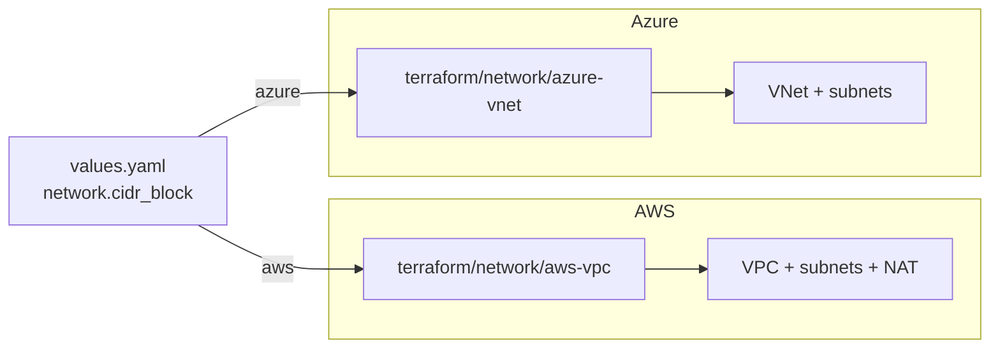

# Network

The network category has two drivers. `aws-vpc` builds a VPC with
public and private subnets, an Internet Gateway, and per-AZ NAT
Gateways. `azure-vnet` builds a VNet with private subnets. The driver
is selected by `platform`. Local platforms (`docker`, `hyperv`,
`incus`, and `metal`) don't use this layer; their compute driver
creates networking directly on the host (bridges, NAT, NodePort
forwards). The shared `network.cidr_block` schema field is what drives
both paths.

## Architecture



The network module runs after `backend` and before `cluster`. The
cluster modules then consume the VPC or VNet IDs and subnet IDs as
inputs.

## Recipes

### AWS VPC

```yaml
platform: aws
network:
  cidr_block: 10.20.0.0/16    # default 10.5.0.0/16
dns:
  private_domain: corp.example.internal    # optional
```

The module provisions a multi-AZ VPC with public and private subnets,
an Internet Gateway, and per-AZ NAT Gateways for private-subnet
egress. When `dns.private_domain` is set, it also creates a
VPC-scoped private Route53 zone so workloads inside the VPC resolve
internal names.

### Azure VNet

```yaml
platform: azure
network:
  cidr_block: 10.30.0.0/16
```

The module provisions a VNet with private subnets carved from
`cidr_block`. Subnet sizing matters more here than on AWS, because
AKS with Azure CNI pulls Pod IPs straight from the VNet (each Pod
consumes one VNet IP). Undersized subnets exhaust quickly. The
default `/16` accommodates production-scale clusters; smaller blocks
are only fine for fixed-size clusters with known pod counts.

### Local (no terraform/network module)

```yaml
platform: hyperv    # or docker, incus, metal
network:
  cidr_block: 10.5.0.0/16
```

No terraform module runs here. The compute driver creates the
host-local network (Hyper-V NetNat, Incus bridge, Docker bridge).
`cidr_block` is still authoritative though, since node IPs, the
cluster API endpoint, and the load balancer IP pool all derive from
it.

## Operations

The default `network.cidr_block` of `10.5.0.0/16` collides with
corporate VPNs in some environments. Pick an unused /16 in private
space before the first apply, because changing it later requires
destroying compute and re-provisioning.

AKS pod IP exhaustion is a quiet failure mode. Azure CNI pulls Pod
IPs from the VNet rather than from an overlay. If `cidr_block` is too
small for the max pods per node times the node count, AKS Pods stay
Pending with no obvious error. Size the VNet for peak pod density.

If `dns.private_domain` is unset on AWS, no private Route53 zone is
created. In-VPC workloads then only resolve via public DNS or VPC
DNS, so any operator-defined internal names won't work.

The AWS VPC module's `azs`, `public_subnets`, and `private_subnets`
lists are positional. Entry `i` of each list describes the same AZ. A
length mismatch is an error at plan time.

## Security

VPC private subnets have no public IPs and no inbound routes from the
Internet. Egress flows through NAT Gateways (one per AZ for HA).

The AWS VPC module creates a private Route53 zone, and the records in
that zone are visible only inside the VPC.

Azure VNet subnets carry no NSG by default. Security boundaries are
enforced by AKS network policies and the cluster's CNI rather than at
the subnet layer.

## See also

- [aws-vpc/](aws-vpc/) and [azure-vnet/](azure-vnet/) for the per-driver Terraform reference.
- [../cluster/](../cluster/) for the managed-cluster modules that consume the network.
- [../dns/](../dns/) for the public DNS zones (the private zone inside the VPC module is separate).
- [../compute/](../compute/) for the local compute drivers that create their own host networking.
