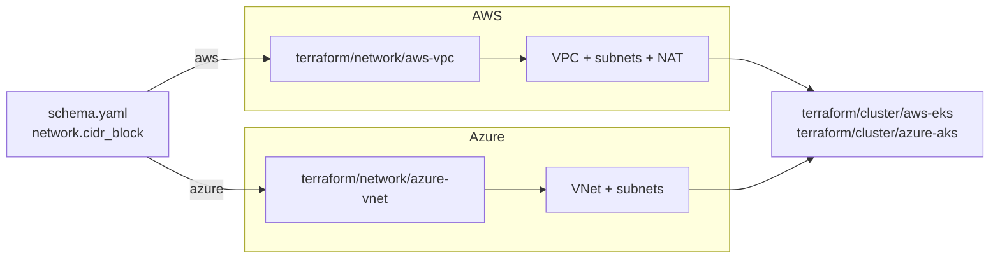

# Network

Two drivers build the cloud-side network fabric: `aws-vpc` (VPC, subnets,
NAT, IGW) and `azure-vnet` (VNet, subnets). Selection is by `platform`.
Local platforms (`docker`, `hyperv`, `incus`, `metal`) do not use this
layer — their compute driver creates networking directly on the host
(bridges, NAT, NodePort forwards). The shared `network.cidr_block` schema
field drives both paths.

## Architecture



The network module runs after `backend` and before `cluster`. Cluster
modules consume the VPC/VNet IDs and subnet IDs as inputs.

## Recipes

### AWS VPC

```yaml
platform: aws
network:
  cidr_block: 10.20.0.0/16    # default 10.5.0.0/16
dns:
  private_domain: corp.example.internal    # optional
```

Provisions a multi-AZ VPC with public and private subnets, an Internet
Gateway, and per-AZ NAT Gateways for private-subnet egress. When
`dns.private_domain` is set, the module also creates a VPC-scoped
private Route53 zone so workloads inside the VPC resolve internal names.

### Azure VNet

```yaml
platform: azure
network:
  cidr_block: 10.30.0.0/16
```

Provisions a VNet with private subnets carved from `cidr_block`. Subnet
sizing matters more here than on AWS: when AKS runs Azure CNI each Pod
consumes one VNet IP, so undersized subnets exhaust quickly. The default
`/16` accommodates production-scale clusters; smaller blocks are fine
only for fixed-size clusters with known pod counts.

### Local (no terraform/network/ module)

```yaml
platform: hyperv    # or docker, incus, metal
network:
  cidr_block: 10.5.0.0/16
```

No terraform module runs. The compute driver creates the host-local
network (Hyper-V NetNat, Incus bridge, Docker bridge). `cidr_block` is
still authoritative — node IPs, the cluster API endpoint, and the load
balancer IP pool all derive from it.

## Operations

- **CIDR conflicts with existing routes** — the default `10.5.0.0/16`
  collides with corporate VPNs in some environments. Pick an unused
  /16 in private space before the first apply; changing it later
  requires destroying compute and re-provisioning.
- **AKS pod IP exhaustion** — Azure CNI pulls Pod IPs from the VNet,
  not from an overlay. If `cidr_block` is too small for the max pods
  per node times the node count, AKS Pods stay Pending with no
  obvious error. Size the VNet for peak pod density.
- **`dns.private_domain` unset on AWS** — no private Route53 zone is
  created. In-VPC workloads only resolve via public DNS or VPC DNS
  (no operator-defined internal names).
- **AZ count mismatch on AWS** — `azs`, `public_subnets`, and
  `private_subnets` are positional: entry `i` of each list describes
  one AZ. Length mismatch is an error at plan time.

## Security

- VPC private subnets have no public IPs and no inbound routes from the
  Internet. Egress flows through NAT Gateways (one per AZ for HA).
- The AWS VPC module creates a private Route53 zone; record contents
  are visible only inside the VPC.
- Azure VNet subnets carry no NSG by default — security boundaries are
  enforced by AKS network policies and the cluster's CNI, not at the
  subnet layer.

## See also

- [aws-vpc/](aws-vpc/), [azure-vnet/](azure-vnet/) — per-driver Terraform reference.
- [../cluster/](../cluster/) — managed-cluster modules that consume the network.
- [../dns/](../dns/) — public DNS zones (separate from the private zone inside the VPC module).
- [../compute/](../compute/) — local compute drivers that create their own host networking.
