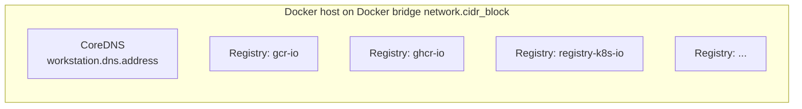
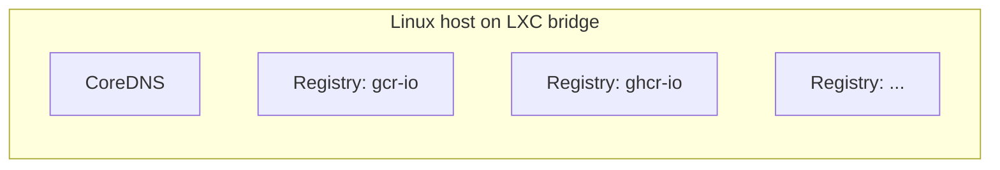

# Workstation

The workstation category has two drivers that provision the host-side
substrate for local clusters. `docker` creates a Docker network with
a CoreDNS resolver and a set of local OCI registry containers.
`incus` creates an LXC bridge with the same companions. The driver
is selected by `platform`. The workstation pass runs before
`compute`, so the compute drivers have a network to attach Talos
nodes to.

`workstation.runtime` is the switch that turns the workstation stack
on. With it unset, no workstation module runs even on a local
platform. Hyper-V, bare metal (`platform: metal`), and managed
clouds don't use the workstation layer either: Hyper-V manages its
NetNat inside the compute module, `metal` expects an existing
network, and AWS / Azure have no local workstation concept.

## Recipes

### Docker (macOS or Linux dev)



```yaml
platform: docker
workstation:
  runtime: docker-desktop    # or colima, docker
  arch: arm64                # match host architecture
```

The module provisions a Docker bridge network sized from
`network.cidr_block`, a CoreDNS container that resolves the local
registry hostnames, and one container per upstream registry the
context mirrors. `workstation.runtime: colima` is the lighter macOS
path, plain `docker` is the Linux engine path, and `docker-desktop`
is the Docker Desktop path on macOS or Windows.

### Incus (Linux host)



```yaml
platform: incus
workstation:
  runtime: colima            # or docker, docker-desktop; registry runtime only
  arch: amd64
```

The module provisions an Incus LXC bridge and the same CoreDNS plus
registry containers. The registry container runtime is whatever
`workstation.runtime` names; on Incus contexts that selector controls
where the registry containers live, not the cluster VM host. The
cluster VMs are always Incus instances.

## Operations

When `workstation.runtime` is unset on a local platform, no
workstation module runs and there's no host-local network for compute
to attach to. The fix is to set `workstation.runtime` to a value that
matches the host's container runtime.

A `network.cidr_block` conflict with the host LAN is a common
first-time issue. The default is `10.5.0.0/16`. If the developer's
home or corporate network uses that range, the workstation bridge
will route incorrectly. Pick a different /16 in private space before
the first apply.

If local registry pulls fail from inside the cluster, the workstation
provisions registry instances by hostname and a CoreDNS that resolves
them. Pulls failing with DNS errors usually mean the cluster nodes
can't reach `workstation.dns.address`. Pulls failing with HTTP errors
usually mean the registry containers aren't running.

Destroying the workstation while the cluster is still running tears
down the network that compute attached to. Always run
`windsor destroy --force` from the top so the layers come down in
order (compute first, then workstation, then backend).

## Security

The Docker driver uses the host Docker socket and runs containers
with bridge-network privileges. That's root-equivalent on the host
and inappropriate for shared developer machines.

The local registry runs without authentication. Workloads pull
through the cluster's containerd mirror, but the registry endpoint
itself is reachable from any process on the host that knows the
address.

Incus VMs run as full KVM instances. The bridge doesn't isolate the
LAN from the VMs unless the host firewall rules are added explicitly.

## See also

- [docker/](/reference/blueprints/core/terraform/workstation/docker) and [incus/](/reference/blueprints/core/terraform/workstation/incus) for the per-driver Terraform reference.
- [../compute/](/reference/blueprints/core/terraform/compute) for the compute drivers that attach to the workstation network.
- [../network/](/reference/blueprints/core/terraform/network) for `network.cidr_block`, which is the shared knob for both layers.
