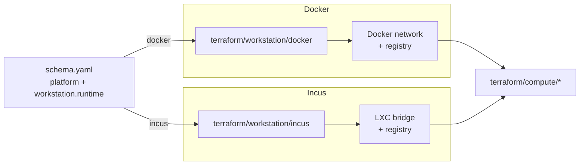

# Workstation

Two drivers provision the host-side substrate for local clusters:
`docker` (Docker network + optional local OCI registry) and `incus`
(LXC bridge + optional registry). Selection follows `platform`; the
workstation pass runs **before** `compute` so compute drivers can attach
nodes to a network the workstation already created.

`workstation.runtime` is the switch that turns the workstation stack on.
With it unset, no workstation module runs even on a local platform.

## Architecture



Hyper-V, bare metal (`platform: metal`), and managed clouds do not use
the workstation layer. Hyper-V manages its NetNat inside the compute
module; `metal` expects an existing network; AWS / Azure have no local
workstation concept.

## Recipes

### Docker (macOS / Linux dev)

```yaml
platform: docker
workstation:
  runtime: docker-desktop    # or colima, docker
  arch: arm64                # match host architecture
```

Provisions a Docker bridge network sized from `network.cidr_block` and
optionally a local registry that the `compute/docker` step then attaches
Talos containers to. `workstation.runtime: colima` is the lighter macOS
path; plain `docker` is the Linux engine path; `docker-desktop` is the
Docker Desktop path on macOS or Windows.

### Incus (Linux host)

```yaml
platform: incus
workstation:
  runtime: colima            # or docker, docker-desktop — registry runtime only
  arch: amd64
```

Provisions an Incus LXC bridge and (optionally) a local registry. The
registry is delivered via the runtime mentioned in `workstation.runtime`,
which on Incus contexts only controls where the registry container
lives — not the cluster VM host (those are always Incus instances).

## Operations

- **`workstation.runtime` unset on a local platform** — no workstation
  module runs, no host-local network exists, and `compute` will fail
  to attach Talos nodes. The fix is to set `workstation.runtime` to a
  value that matches the host's container runtime.
- **Network CIDR conflicts with the host LAN** — `network.cidr_block`
  defaults to `10.5.0.0/16`. If the developer's home or corp network
  uses this range, the workstation bridge will route incorrectly. Pick
  a different /16 in private space before the first apply.
- **Local registry pulls fail from inside the cluster** — the
  workstation provisions registry instances by hostname and a CoreDNS
  that resolves them. Pulls failing with DNS errors usually mean the
  cluster nodes can't reach `workstation.dns.address`. Pulls failing
  with HTTP errors usually mean the registry containers aren't running.
- **Workstation destroyed but cluster still running** — destroying the
  workstation tears down the network the compute module attached to.
  Always `windsor destroy --force` from the top to tear down compute
  first, then workstation, then backend.

## Security

- The Docker driver uses the host Docker socket and runs containers
  with bridge-network privileges. This is root-equivalent on the host
  and inappropriate for shared developer machines.
- The local registry runs without authentication. Workloads pull
  through the cluster's containerd mirror, but the registry endpoint
  is reachable from any process on the host that knows the address.
- Incus VMs run as full KVM instances; the bridge does not isolate
  hosts on the LAN from the VMs unless host firewall rules are added
  explicitly.

## See also

- [docker/](docker/), [incus/](incus/) — per-driver Terraform reference.
- [../compute/](../compute/) — compute drivers that attach to the workstation network.
- [../network/](../network/) — `network.cidr_block` derivation for both layers.
